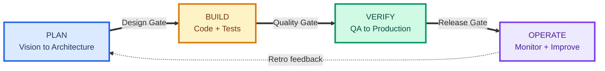
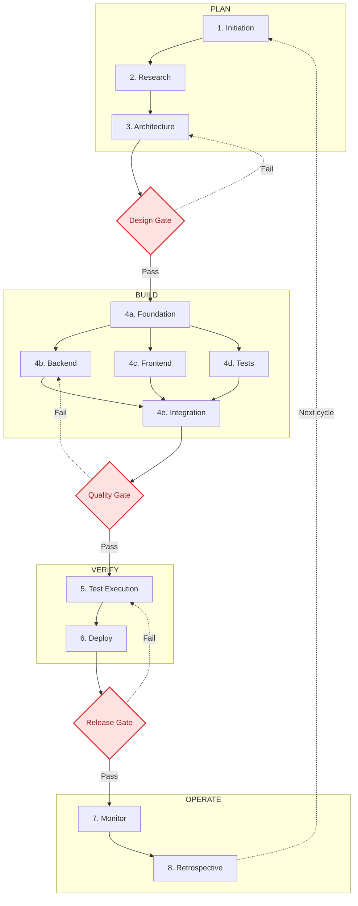
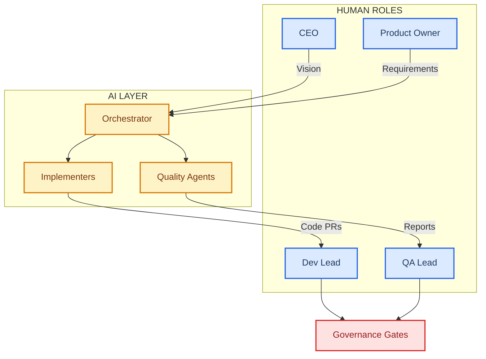
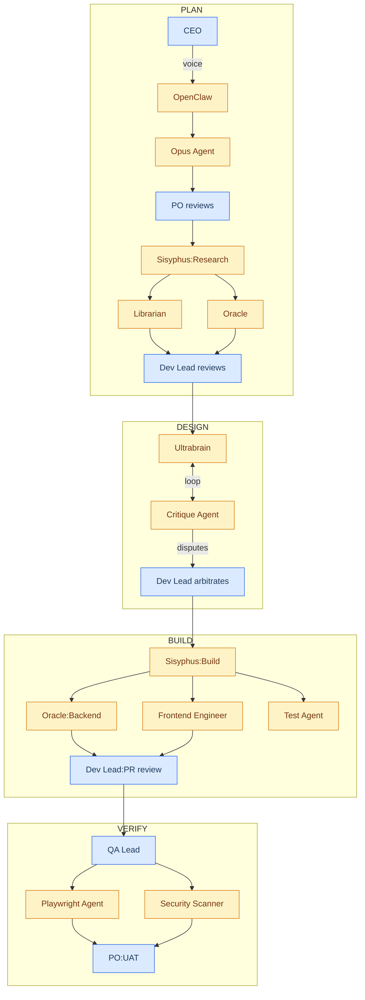
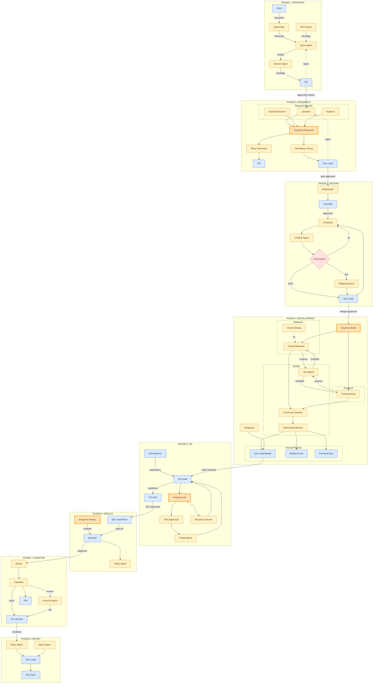
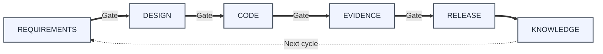
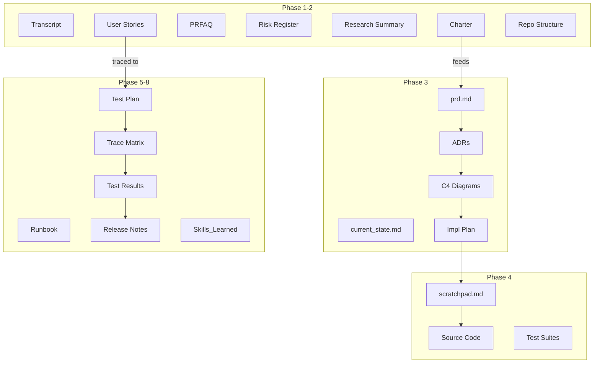
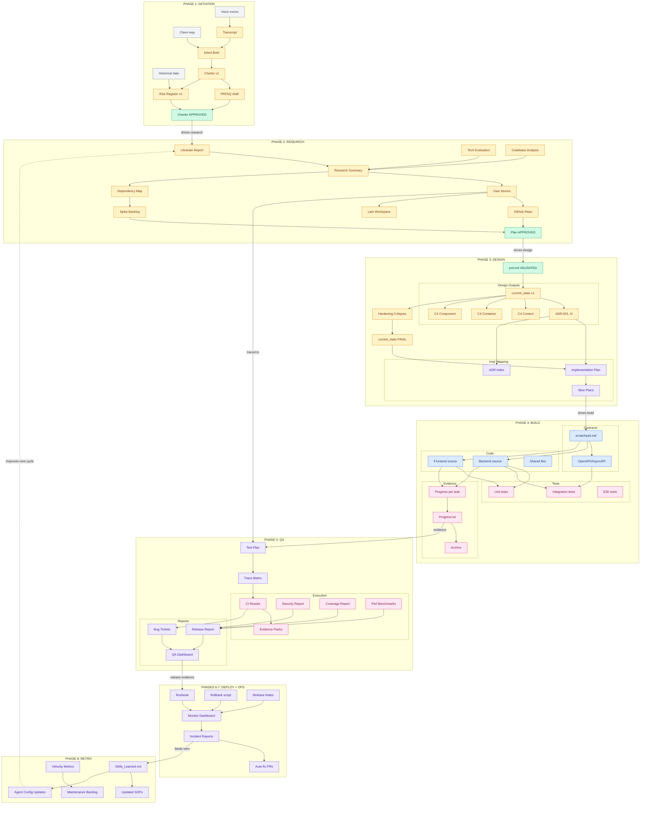

# AI-Integrated SDLC: Complete Visualization Atlas

## Navigation Matrix

| | **Workflow / Process** | **People & AI Collaboration** | **Artifacts & Data Flow** |
|---|---|---|---|
| **HIGH** (Exec, 6-8 nodes) | [1.1 Macro Flow](#11-workflow--high) | [2.1 Role Clusters](#21-people--ai--high) | [3.1 Artifact Clusters](#31-artifacts--high) |
| **MID** (Managers, 20-25 nodes) | [1.2 Phase Detail](#12-workflow--mid) | [2.2 Delegation Map](#22-people--ai--mid) | [3.2 Document Flow](#32-artifacts--mid) |
| **LOW** (Practitioners, single full-map per perspective) | [1.3 Full Process Map](#13-workflow--low) | [2.3 Interaction Matrix](#23-people--ai--low) | [3.3 Complete I/O Map](#33-artifacts--low) |

**Design Rules:**
- Governance embedded as gate nodes (red), not a separate layer
- One LOW diagram per perspective (no 1.3a/1.3b/1.3c style decomposition)
- Max 6 connections per node; split hubs into phase-scoped instances inside the same LOW diagram
- Node labels: short name only. Full metadata in reference tables below each diagram
- Line breaks use ` ` for Mermaid compatibility

### Readability Validation Snapshot

| Diagram | Approx Nodes | Max Node Degree | Hub Status |
|---|---:|---:|---|
| 1.3 Workflow - LOW | ~96 | 5 | OK |
| 2.3 People & AI - LOW | ~78 | 5 | OK |
| 3.3 Artifacts - LOW | ~68 | 6 | OK |

---

# PERSPECTIVE 1: WORKFLOW / PROCESS

---

## 1.1 Workflow — HIGH

---

## 1.2 Workflow — MID

---

## 1.3 Workflow — LOW

```mermaid
graph TB
    subgraph P1["PHASE 1: INITIATION"]
        P1i1["Voice memo"]
        P1i2["Client requirements"]
        P1i3["Historical data"]
        P1s1["Transcribe"]
        P1s2["Structure intent"]
        P1s3["Cross-ref history"]
        P1s4["Generate charter"]
        P1s5["Generate PRFAQ"]
        P1s6["Risk assessment"]

        P1i1 --> P1s1 --> P1s2
        P1i2 --> P1s2
        P1i3 --> P1s3
        P1s3 --> P1s4
        P1s2 --> P1s4
        P1s4 --> P1s5
        P1s4 --> P1s6
    end

    P1g{"Gate 1:<br/>Charter Review"}
    P1s5 --> P1g
    P1s6 --> P1g
    P1g -.->|Reject| P1s4

    subgraph P2["PHASE 2: RESEARCH"]
        subgraph P2par["Parallel Research"]
            P2a1["Librarian search"]
            P2a2["Oracle tech eval"]
            P2a3["Codebase scan"]
        end
        P2s1["Synthesize research"]
        P2s2["Generate stories"]
        P2s3["Setup repo"]
        P2s4["Setup Lark board"]
        P2s5["Dependency graph"]
        P2s6["Identify spikes"]

        P2a1 --> P2s1
        P2a2 --> P2s1
        P2a3 --> P2s1
        P2s1 --> P2s2
        P2s1 --> P2s5
        P2s2 --> P2s3
        P2s2 --> P2s4
        P2s5 --> P2s6
    end

    P2g{"Gate 2:<br/>Plan Review"}
    P2s3 --> P2g
    P2s6 --> P2g
    P2g -.->|Reject| P2a1

    subgraph P3["PHASE 3: DESIGN"]
        P3v1["Gatekeeper audit"]
        P3v2["5-pillar PRD check"]

        subgraph P3loop["Synthesis-Critique Loop"]
            P3s1["Synthesize design"]
            P3s2["Critique design"]
            P3s3{"Fatal flaws?"}
            P3s4["Revise design"]
            P3s1 --> P3s2 --> P3s3
            P3s3 -->|Yes| P3s4 --> P3s2
        end

        P3m1["C4 decomposition"]
        P3m2["Extract DoD criteria"]
        P3m3["Sequence roadmap"]

        P3v1 --> P3v2 --> P3s1
        P3s3 -->|"No flaws"| P3m1
        P3m1 --> P3m2 --> P3m3
    end

    P3g{"Gate 3:<br/>Architecture"}
    P3m3 --> P3g
    P3g -.->|Reject| P3s1

    subgraph P4["PHASE 4: DEVELOPMENT"]
        subgraph P4f["Foundation"]
            P4f1["Provision infra"]
            P4f2["Setup CI/CD"]
            P4f3["Auth + secrets"]
            P4f4["Observability"]
            P4f5["Shared libs"]
            P4f1 --> P4f2 --> P4f3 --> P4f4 --> P4f5
        end

        subgraph P4k["Thin Thread"]
            P4k1["Deploy containers"]
            P4k2["E2E request flow"]
            P4k3["Contract stubs"]
            P4k1 --> P4k2 --> P4k3
        end

        subgraph P4v["Vertical Slice Loop"]
            P4v1["Sign interface treaty"]
            P4v2["Implement"]
            P4v3["Test"]
            P4v4["Benchmark"]
            P4v5["Adversarial review"]
            P4v6{"Exit criteria?"}
            P4v7["Document module"]
            P4v1 --> P4v2 --> P4v3 --> P4v4 --> P4v5 --> P4v6
            P4v6 -->|No| P4v2
            P4v6 -->|Yes| P4v7
        end

        subgraph P4i["Integration"]
            P4i1["Cross-module wiring"]
            P4i2["E2E smoke test"]
            P4i1 --> P4i2
        end

        P4f5 --> P4k1
        P4k3 --> P4v1
        P4v7 --> P4i1
    end

    subgraph P5["PHASE 5: QA"]
        P5p1["Generate test plan"]
        P5p2["Risk-based priority"]
        P5d1["Generate scenarios"]
        P5d2["Traceability matrix"]
        P5d3["Auto vs manual split"]

        subgraph P5exec["Test Execution"]
            P5e1["Smoke suite"]
            P5e2["Targeted regression"]
            P5e3["Full regression"]
            P5e4["Security scan"]
            P5e5["Performance test"]
        end

        subgraph P5tri["Triage"]
            P5t1["Classify failures"]
            P5t2["Create bug tickets"]
            P5t3["Auto-rerun rules"]
        end

        P5r1["Aggregate results"]
        P5r2["Update dashboard"]
        P5r3["Go/No-Go recommendation"]

        P5p1 --> P5p2 --> P5d1 --> P5d2 --> P5d3
        P5d3 --> P5e1
        P5e1 --> P5e2 --> P5e3
        P5e1 --> P5e4
        P5e1 --> P5e5
        P5e3 --> P5t1
        P5e4 --> P5t1
        P5t1 --> P5t2
        P5t1 --> P5t3
        P5e3 --> P5r1
        P5e5 --> P5r1
        P5r1 --> P5r2 --> P5r3
    end

    P5g{"Gate 5:<br/>Release Readiness"}
    P5r3 --> P5g
    P5g -.->|Fail| P4v2

    subgraph P6["PHASE 6: DEPLOYMENT"]
        P6s1["Generate runbook"]
        P6s2["Generate rollback"]
        P6s3["Deploy to staging"]
        P6s4["Health checks"]
        P6s5{"Prod sign-off"}
        P6s6["Deploy to production"]
        P6s7["Generate release notes"]
        P6s8["Notify stakeholders"]

        P6s1 --> P6s3
        P6s2 --> P6s3
        P6s3 --> P6s4 --> P6s5
        P6s5 -->|Approve| P6s6 --> P6s7 --> P6s8
        P6s5 -.->|Reject| P6s3
    end

    subgraph P7["PHASE 7: MONITORING"]
        P7s1["Error capture"]
        P7s2["Heartbeat checks"]
        P7s3["Perf monitoring"]
        P7s4["AI classification"]
        P7s5["Pattern matching"]
        P7s6{"Known pattern?"}
        P7s7["Auto-fix PR"]
        P7s8["Escalate to human"]
        P7s9["Incident report"]

        P7s1 --> P7s4
        P7s2 --> P7s4
        P7s3 --> P7s4
        P7s4 --> P7s5 --> P7s6
        P7s6 -->|Yes| P7s7 --> P7s9
        P7s6 -->|No| P7s8 --> P7s9
    end

    subgraph P8["PHASE 8: RETROSPECTIVE"]
        P8s1["Velocity analysis"]
        P8s2["Identify bottlenecks"]
        P8s3["Tune agent prompts"]
        P8s4["Update SOPs"]
        P8s5["Test debt backlog"]
        P8s6["Capture knowledge"]

        P8s1 --> P8s2
        P8s2 --> P8s3
        P8s2 --> P8s4
        P8s2 --> P8s5
        P8s3 --> P8s6
        P8s4 --> P8s6
        P8s5 --> P8s6
    end

    P1g -->|Pass| P2a1
    P2g -->|Pass| P3v1
    P3g -->|Pass| P4f1
    P4i2 --> P5p1
    P5g -->|Pass| P6s1
    P6s8 --> P7s1
    P7s9 --> P8s1
    P8s6 -.->|"Next cycle"| P1i1
    P7s7 -.->|"Hotfix"| P4v2
    P5t2 -.->|"Bug tickets"| P4v2

    classDef gate fill:#FEE2E2,stroke:#DC2626,stroke-width:2px,color:#991B1B
    class P1g,P2g,P3g,P3s3,P4v6,P5g,P6s5,P7s6 gate
```

### Workflow LOW Reference Table

| Step | Tool/Agent | Output | Gov |
|------|-----------|--------|-----|
| P1s1 Transcribe | OpenClaw API | transcript.md | No PII |
| P1s2 Structure intent | Opus-tier LLM | Intent Brief | — |
| P1s3 Cross-ref history | RAG over GDrive | Risk flags | — |
| P1s4 Generate charter | Opus-tier LLM | Charter v1 | — |
| P1s5 Generate PRFAQ | Sonnet-tier LLM | PRFAQ draft | — |
| P1s6 Risk assessment | LLM + historical | Risk Register | — |
| Gate 1 | PO + CEO | Approved charter | Timestamped |
| P2a1 Librarian | Sonnet 4.5 | Patterns report | — |
| P2a2 Oracle tech eval | GPT-5.2 | Scored matrix | — |
| P2a3 Codebase scan | Code scanner | Reuse candidates | — |
| P2s1 Synthesize | Sisyphus merges | Summary .md | — |
| P2s2 Stories | LLM + PO | Lark Tasks | — |
| P2s3 Setup repo | GitHub API | Repo + AGENTS.md | Branch protect |
| P2s4 Lark board | Lark API | Board + templates | — |
| P2s5 Dependency graph | LLM analysis | Feature dep map | — |
| P2s6 Spikes | LLM | Spike backlog | — |
| Gate 2 | Dev Lead + PO | Plan approval | Timestamped |
| P3v1 Gatekeeper | Gatekeeper skill | Gap analysis | — |
| P3v2 5-pillar | LLM validator | Validated prd.md | All 5 pass |
| P3s1 Synthesize | Ultrabrain Opus 4.5 | current_state + ADRs + C4 | — |
| P3s2 Critique | Different model | 9-dim hardening | Can't delete |
| P3m1 C4 decompose | Mapping skill | Tasks | — |
| P3m2 DoD extract | From ADRs | Quality criteria | — |
| P3m3 Sequence | LLM | Foundation→Skeleton→Slices | — |
| Gate 3 | Dev Lead | Architecture approval | — |
| P4f1-f5 Foundation | IaC, GitHub Actions, Vault, Sentry | Running infra + CI | — |
| P4k1-k3 Thin thread | Deploy tools | All services running | — |
| P4v1 Treaty | scratchpad.md | Signed contract | Both sign |
| P4v2 Implement | Coding agent | Source code | allowed_paths |
| P4v3 Test | Test agent | Unit + integration | — |
| P4v4 Benchmark | Perf harness | Latency/throughput | — |
| P4v5 Review | Adversarial reviewer | Security findings | — |
| P4v6 Exit | Decision point | Pass/fail | Coverage>80% |
| P4v7 Document | LLM | Module docs | — |
| P4i1-i2 Integrate | Integrator + Playwright | Integrated + smoke | — |
| P5p1-d3 Plan+Design | LLM + QA Lead | Test plan + cases | — |
| P5e1-e5 Execute | Playwright, CI, load | All results | — |
| P5t1-t3 Triage | Flash-tier LLM | Classified bugs | SLA timer |
| P5r1-r3 Report | LLM analytics | Dashboard + Go/NoGo | — |
| Gate 5 | QA Lead + PO | Release readiness | — |
| P6s1-s8 Deploy | CI/CD, LLM | Prod + notes + notify | Human sign-off |
| P7s1-s9 Monitor | Sentry, LLM | Classification + fix/escalate | Fix PR needs approval |
| P8s1-s6 Retro | LLM analysis | SOPs + configs + metrics | Pruned each cycle |

---

# PERSPECTIVE 2: PEOPLE & AI COLLABORATION

---

## 2.1 People & AI — HIGH

---

## 2.2 People & AI — MID

---

## 2.3 People & AI — LOW

**Reading guide:** Blue = human. Amber = AI agent. Dark amber border = orchestrator. Red = decision gate. Phase-scoped instances prevent hub overload.

### People LOW — Reference Table

| Actor | Model/Tool | Phase | Role | Max Connections |
|-------|-----------|-------|------|-----------------|
| CEO_P1 | Human | 1 | Vision input via Telegram | 1 |
| OC_P1 | Transcription API | 1 | Audio/text to transcript | 2 |
| OPUS_P1 | Claude Opus 4.5 | 1 | Structure charter | 4 |
| RAG_P1 | Embedding search | 1 | Historical cross-ref | 1 |
| SON_P1 | Claude Sonnet 4.5 | 1 | PRFAQ + Risk Register | 2 |
| PO_P1 | Human | 1 | Charter approval | 3 |
| LIB_P2 | Claude Sonnet 4.5 | 2 | Doc/pattern research | 2 |
| ORA_P2 | GPT-5.2 | 2 | Tech stack evaluation | 2 |
| EXP_P2 | Codebase scanner | 2 | Reuse candidates | 1 |
| SIS_P2 | Claude Opus 4.5 | 2 | Research orchestration | 4 |
| STORY_P2 | Sonnet-tier | 2 | Stories from charter | 2 |
| SETUP_P2 | GitHub + Lark APIs | 2 | Repo + board creation | 2 |
| GK_P3 | LLM + gatekeeper skill | 3 | PRD audit | 2 |
| UB_P3 | Claude Opus 4.5 | 3 | Design: current_state + ADRs + C4 | 5 |
| CRIT_P3 | Different model | 3 | 9-dimension hardening | 2 |
| MAP_P3 | LLM + mapping skill | 3 | C4 to impl tasks | 2 |
| SIS_P4 | Claude Opus 4.5 | 4 | Task dispatch + allowed_paths | 2 |
| ORA_P4 | GPT-5.2 | 4 | Backend code (src/api/) | 5 |
| ORA_DBG | GPT-5.2 | 4 | Fix suggestions | 1 |
| FEA_P4 | Gemini 3 Pro | 4 | UI implementation (src/ui/) | 5 |
| TEST_P4 | Sonnet-tier | 4 | Test gen + contract signing | 4 |
| CC_P4 | Pre-commit hook | 4 | AI slop detection | 2 |
| ADV_P4 | Independent model | 4 | Security + edge cases | 4 |
| INT_P4 | Cross-module agent | 4 | Module wiring | 1 |
| QAL_P5 | Human | 5 | Test strategy + release | 5 |
| QAE_P5 | Human | 5 | Manual exploratory | 1 |
| SIS_P5 | Claude Opus 4.5 | 5 | Test orchestration | 3 |
| TEST_P5 | CI runner | 5 | Automated execution | 2 |
| SEC_P5 | GPT-5.2 CVE-Bench | 5 | Vulnerability scan | 2 |
| TRI_P5 | Flash-tier | 5 | Failure classification | 2 |
| SIS_P6 | Claude Opus 4.5 | 6 | Runbook generation | 1 |
| OPS_P6 | Human | 6 | Deploy execution | 3 |
| SENT_P7 | Webhook tool | 7 | Error capture | 1 |
| CLS_P7 | LLM triage | 7 | Severity + pattern | 3 |
| FIX_P7 | Coding agent | 7 | Fix PR (human approves) | 2 |
| OC_P7 | Human | 7 | Fix approval, escalation | 3 |
| RET_P8 | LLM analysis | 8 | Process improvement | 1 |
| MAINT_P8 | LLM analysis | 8 | Test debt cleanup | 1 |

### Governance Gates (all require human approval)

| Gate | Between | Approver | Criteria |
|------|---------|----------|----------|
| Charter Review | P1 → P2 | PO + CEO | Charter complete, risks acceptable |
| Plan Review | P2 → P3 | Dev Lead + PO | Tech stack approved, stories estimated |
| Architecture | P3 → P4 | Dev Lead | Critiques resolved, impl plan reviewed |
| PR Approval | Within P4 | Dev Lead | Tests pass, no AI slop, review clean |
| Release Readiness | P5 → P6 | QA Lead + PO | No critical vulns, UAT passed |
| Prod Sign-off | P6 deploy | Dev Lead + PO | Staging healthy, rollback tested |
| Fix Approval | P7 hotfix | On-call Eng | Auto-fix PR reviewed |

---

# PERSPECTIVE 3: ARTIFACTS & DATA FLOW

---

## 3.1 Artifacts — HIGH

---

## 3.2 Artifacts — MID

---

## 3.3 Artifacts — LOW

**Reading guide:** Gray = external input. Amber = generated. Green = approved/validated. Blue = code. Pink = evidence. Purple = reports/ops. Short labels only; see reference table for format, storage, creator, governance.

### Artifacts LOW — Reference Table

| ID | Artifact | Creator | Format | Storage | Governance |
|----|----------|---------|--------|---------|------------|
| EI1 | Voice memo | CEO | Audio .ogg/.mp3 | Telegram (transient) | — |
| EI2 | Client reqs | Client | Email/PDF/Doc | GDrive/Inbox | — |
| EI3 | Historical data | Archive | Mixed | GDrive/Archive | — |
| A01 | Transcript | OpenClaw | .md + timestamps | GDrive/transcripts/ | No PII |
| A02 | Intent Brief | Opus Agent | 1-page Google Doc | GDrive/Project/ | — |
| A03 | Charter v1 | Opus Agent | Google Doc | GDrive/Project/ | — |
| A04 | PRFAQ draft | Sonnet Agent | Google Doc | GDrive/Project/ | — |
| A05 | Risk Register v1 | LLM + historical | Google Sheet | GDrive/Project/ | — |
| A07 | Charter APPROVED | PO + CEO | Google Doc | GDrive/Project/ | Timestamped |
| A08 | Librarian Report | Sonnet 4.5 | .md | GitHub docs/research/ | — |
| A09 | Tech Evaluation | Oracle GPT-5.2 | Scored matrix .md | GitHub docs/research/ | — |
| A10 | Codebase Analysis | Explorer Agent | .md | GitHub docs/research/ | — |
| A11 | Research Summary | Sisyphus | .md | GitHub docs/research/ | — |
| A12 | User Stories | LLM + PO | Lark Tasks | Lark Board | — |
| A13 | GitHub Repo | GitHub API | Dirs + AGENTS.md | GitHub | Branch protection |
| A14 | Lark Workspace | Lark API | Board + templates | Lark | — |
| A15 | Dependency Map | LLM | Mermaid .md | GitHub docs/planning/ | — |
| A16 | Spike Backlog | LLM | Lark Tasks | Lark Board | — |
| A17 | Plan APPROVED | Dev Lead + PO | Lark approval | Lark | Timestamped |
| A18 | prd.md VALIDATED | Gatekeeper | Markdown | GitHub root | 5 pillars pass |
| A19 | current_state v1 | Ultrabrain | Markdown | GitHub root | — |
| A20 | ADR-001..N | Ultrabrain | .md per decision | docs/adr/ | Append-only |
| A21 | C4 Context | Ultrabrain | Mermaid | docs/diagrams/ | — |
| A22 | C4 Container | Ultrabrain | Mermaid | docs/diagrams/ | — |
| A23 | C4 Component | Ultrabrain | Mermaid | docs/diagrams/ | — |
| A24 | Hardening Critiques | Critique Agent | .md | docs/hardening/ | Cannot delete |
| A25 | current_state FINAL | Ultrabrain | Markdown | GitHub root | Post-hardening |
| A26 | Impl Plan | Mapping skill | .md per phase | docs/impl-plan/ | — |
| A27 | Slice Plans | Mapping skill | .md per slice | docs/impl-plan/ | — |
| A28 | ADR Index | Auto-generated | Table .md | .agent-workflow/ | — |
| A29 | scratchpad.md | Impl + Test agents | Markdown | .agent-workflow/ | Signed before code |
| A30 | API Contracts | From scratchpad | OpenAPI/AsyncAPI | docs/contracts/ | — |
| A31 | Backend source | Oracle/Ultrabrain | Go/TS/Python | src/api/ | allowed_paths |
| A32 | Frontend source | Frontend Eng | React/Next.js | src/ui/ | allowed_paths |
| A33 | Shared libs | Impl agents | TS/Go modules | src/shared/ | — |
| A34 | Unit tests | Test Agent | Jest/Pytest | tests/unit/ | — |
| A35 | Integration tests | Test Agent | Test files | tests/integration/ | — |
| A36 | E2E tests | Playwright | .spec.ts | tests/e2e/ | — |
| A37 | Progress per task | Subagents | .md per task | .agent-workflow/progress/ | — |
| A38 | Progress.txt | Sisyphus | Append-only | .agent-workflow/ | Archived each slice |
| A39 | Archive | System | Timestamped dirs | .agent-workflow/archive/ | — |
| A40 | Test Plan | LLM + QA Lead | Google Doc | GDrive/QA/ | — |
| A41 | Trace Matrix | Auto-generated | Lark Base | Lark Base | — |
| A42 | CI Results | GitHub Actions | XML/JSON | CI artifacts | — |
| A43 | Security Report | Oracle CVE | .md | docs/security/ | — |
| A44 | Coverage Report | CI tool | HTML + JSON | CI artifacts | — |
| A45 | Perf Benchmarks | Load tools | JSON + charts | CI artifacts | — |
| A46 | Evidence Packs | Auto-generated | ZIP (trace, video, logs) | CI artifacts | — |
| A47 | Bug Tickets | Triage Agent | Lark Tasks | Lark Board | SLA auto-set |
| A48 | Release Report | LLM analytics | Google Doc | GDrive/QA/ | — |
| A49 | QA Dashboard | Auto-populated | Lark Base | Lark Base | — |
| A50 | Runbook | LLM from IaC | .md | docs/deploy/ | — |
| A51 | Rollback script | Auto-generated | .md + script | docs/deploy/ | — |
| A52 | Release Notes | LLM from PRs | CHANGELOG.md | GitHub root | — |
| A53 | Monitor Dashboard | Datadog/Sentry | Web dashboard | Datadog/Sentry | — |
| A54 | Incident Reports | LLM + human | Google Doc | GDrive/Incidents/ | Human RCA |
| A55 | Auto-fix PRs | Coding agent | GitHub PR | GitHub | Human approves |
| A56 | Skills_Learned | Retro Agent | .md (15 bullets max) | .agent-workflow/ | Pruned each cycle |
| A57 | Updated SOPs | Retro Agent | .md per SOP | .agent-workflow/SOPs/ | — |
| A58 | Velocity Metrics | LLM analysis | Dashboard | Lark Base | — |
| A59 | Maint Backlog | Maint Agent | Lark Tasks | Lark Board | — |
| A60 | Agent Configs | Based on learnings | Skill .md files | .agent/skills/ | — |

---

# APPENDIX: Protocol Reference

| Connection | Protocol | Format | Trigger |
|------------|----------|--------|---------|
| CEO → OpenClaw | Telegram/WhatsApp webhook | Audio/Text | Manual |
| OpenClaw → Orchestrator | Internal API | JSON transcript | Webhook |
| Orchestrator → Agents | Task packet dispatch | JSON + allowed_paths | Phase transition |
| Agent → GitHub | GitHub API / Git | PR diff | Impl done |
| GitHub → CI | Actions webhook | YAML | PR/push |
| Triage → Lark | Lark API | Task JSON | Test failure |
| Sentry → Orchestrator | Sentry webhook | Error JSON | Threshold |
| Agent → GDrive | Drive API | Doc/Sheet | Doc generation |
