```mermaid
graph TB
    Business["🎯 BUSINESS<br/>CEO + PO"]
    Technical["⚙️ TECHNICAL<br/>Tech + Dev Lead"]
    Execution["💻 EXECUTION<br/>Devs"]
    Quality["✅ QUALITY<br/>QA + DevOps"]
    AI["🤖 AI<br/>Sisyphus + Agents"]
    
    Business --> Technical --> Execution --> Quality
    AI -.Assists.-> Business
    AI -.Assists.-> Technical
    AI -.Assists.-> Execution
    AI -.Assists.-> Quality
    Quality -.Feedback.-> Execution
    
    style Business fill:#FF6B6B,color:#FFF
    style AI fill:#FFD93D
```

```mermaid
graph LR
    Vision["📝 VISION<br/>Ideas"]
    Design["🏗️ DESIGN<br/>Architecture"]
    Code["💾 CODE<br/>Software"]
    Prod["🚀 PRODUCTION<br/>Live"]
    Learn["📚 LESSONS<br/>Improve"]
    
    Vision ==>|Gate:<br/>CEO+PO| Design
    Design ==>|Gate:<br/>Arch Review| Code
    Code ==>|Gate:<br/>QA+DevOps| Prod
    Prod ==>|Gate:<br/>Weekly| Learn
    Learn -.Next.-> Vision
    
    style Vision fill:#FFB6C1,stroke:#CC0066,stroke-width:4px
    style Design fill:#E6FFE6,stroke:#00AA00,stroke-width:4px
    style Code fill:#FFF4E6,stroke:#FF9900,stroke-width:4px
    style Prod fill:#90EE90,stroke:#008800,stroke-width:4px
    style Learn fill:#FFFACD,stroke:#FFD700,stroke-width:4px
```

# SDLC Complete System - 3 Perspectives × 3 Zoom Levels

## System Overview

**3 Perspectives** (different angles):
1. **WORK FLOW** - What work happens + when + parallelism
2. **PEOPLE & AI** - Who collaborates + human-AI interaction
3. **GOVERNANCE** - What moves + who approves

**3 Zoom Levels** (same perspective, different detail):
- **HIGH** - 4-8 components (executives, 30 sec)
- **MID** - 15-25 components (managers, 5 min)
- **LOW** - 40+ components (practitioners, 20 min)

**Total: 9 diagrams**

---

# PERSPECTIVE 1: WORK FLOW

## 🔭 LEVEL HIGH (4 components)

```mermaid
graph LR
    Plan["📋 PLAN<br/><br/>Vision → Design<br/>Weeks 1-2"]
    Build["🔨 BUILD<br/><br/>Code + Tests<br/>Weeks 3-6"]
    Ship["🚀 SHIP<br/><br/>QA → Production<br/>Week 7"]
    Learn["📈 LEARN<br/><br/>Monitor → Improve<br/>Ongoing"]
    
    Plan ==> Build ==> Ship ==> Learn
    Learn -.Feedback.-> Plan
    
    style Plan fill:#4ECDC4,stroke:#00A896,stroke-width:6px
    style Build fill:#FFD93D,stroke:#F4A261,stroke-width:6px
    style Ship fill:#95E1D3,stroke:#38B000,stroke-width:6px
    style Learn fill:#AA96DA,stroke:#6A4C93,stroke-width:6px
```

---

## 🔬 LEVEL MID (16 components)

---

## 🔍 LEVEL LOW (50+ components)

```mermaid
graph TB
    Start([🎬 Project Kickoff])
    
    subgraph P1["━━━ PHASE 1: INITIATION ━━━"]
        direction TB
        I1[CEO Vision Input<br/>Voice Memo/Telegram]
        I2[OpenClaw<br/>Transcription]
        I3[Opus 4.5<br/>Analysis]
        I4[Generate<br/>Project Charter]
        I5{CEO + PO<br/>Approve?}
        
        I1 --> I2 --> I3 --> I4 --> I5
        I5 -->|No - Revise| I4
    end
    
    subgraph P2["━━━ PHASE 2: RESEARCH & PLANNING ━━━"]
        direction TB
        R1[Sisyphus<br/>Orchestrates]
        
        subgraph R_Agents["AI Research Agents"]
            R2[Librarian<br/>Doc Search]
            R3[Oracle<br/>Analysis]
            R4[Explore<br/>Codebase]
        end
        
        R5[Synthesize<br/>Findings]
        R6[Generate<br/>User Stories]
        R7[Create Artifacts:<br/>GitHub + Lark]
        R8{Dev Lead + PO<br/>Approve?}
        
        R1 --> R2
        R1 --> R3
        R1 --> R4
        R2 --> R5
        R3 --> R5
        R4 --> R5
        R5 --> R6
        R6 --> R7
        R7 --> R8
        R8 -->|No - Refine| R5
    end
    
    subgraph P3["━━━ PHASE 3: ARCHITECTURE ━━━"]
        direction TB
        A1[Gatekeeper<br/>Validate PRD]
        A2[Synthesis<br/>Generate ADRs + C4]
        A3[Hardening<br/>9 Stress Tests]
        A4{Critical<br/>Issues?}
        A5[Mapper<br/>Create Impl Plan]
        A6{Architecture<br/>Review Approve?}
        
        A1 --> A2 --> A3 --> A4
        A4 -->|Yes - Fix| A2
        A4 -->|No| A5 --> A6
        A6 -->|No - Redesign| A2
    end
    
    subgraph P4["━━━ PHASE 4: IMPLEMENTATION ━━━"]
        direction TB
        
        subgraph P4_Foundation["4a. Foundation Layer"]
            F1[Infrastructure<br/>Provision]
            F2[CI/CD<br/>Setup]
            F3[Observability<br/>Configure]
            F1 --- F2 --- F3
        end
        
        subgraph P4_Parallel["4b. Parallel Development Tracks"]
            direction LR
            
            subgraph P4_Backend["Backend Track"]
                BE1[Module 1:<br/>Auth]
                BE2[Module 2:<br/>Core Logic]
                BE3[Module 3:<br/>Data Layer]
                BE1 --> BE2 --> BE3
            end
            
            subgraph P4_Frontend["Frontend Track"]
                FE1[Framework<br/>Setup]
                FE2[Component<br/>Library]
                FE3[Page<br/>Integration]
                FE1 --> FE2 --> FE3
            end
            
            subgraph P4_Testing["Testing Track"]
                T1[Unit<br/>Tests]
                T2[Integration<br/>Tests]
                T3[Contract<br/>Tests]
                T1 --> T2 --> T3
            end
        end
        
        subgraph P4_Integration["4c. Integration & Hardening"]
            INT1[Integrator Agent<br/>E2E Wiring]
            INT2[Load Testing]
            INT3[Security Scan]
            INT1 --> INT2 --> INT3
        end
        
        F3 --> BE1
        F3 --> FE1
        F3 --> T1
        BE3 --> INT1
        FE3 --> INT1
        T3 --> INT1
    end
    
    subgraph P5["━━━ PHASE 5: QA TESTING ━━━"]
        direction TB
        
        subgraph P5_Generation["Test Generation"]
            Q1[Test Design Agent<br/>Generate Cases]
            Q2[Bug Intake Agent<br/>Evidence Packs]
        end
        
        subgraph P5_Execution["Test Execution"]
            Q3[Unit Test<br/>Execution]
            Q4[Integration Test<br/>Execution]
            Q5[System Test<br/>Execution]
            Q6[E2E Test<br/>Execution]
            Q3 --> Q4 --> Q5 --> Q6
        end
        
        subgraph P5_Validation["Validation"]
            Q7[CI Triage Agent<br/>Analyze Failures]
            Q8{Critical<br/>Bugs Found?}
            Q9{QA Engineer<br/>Sign Off?}
            Q7 --> Q8 --> Q9
        end
        
        Q1 --> Q3
        Q6 --> Q7
        Q8 -->|Yes - Create Evidence| Q2
        Q9 -->|No - Fix Required| Q2
    end
    
    subgraph P6["━━━ PHASE 6: DEPLOYMENT ━━━"]
        direction TB
        
        subgraph P6_Staging["Staging Environment"]
            D1[Build<br/>Staging]
            D2[Deploy<br/>Staging]
            D3[Validation<br/>Tests]
            D1 --> D2 --> D3
        end
        
        subgraph P6_Decision["Go/No-Go"]
            D4[Risk<br/>Assessment]
            D5{PO + DevOps<br/>Approve Deploy?}
            D4 --> D5
        end
        
        subgraph P6_Production["Production Environment"]
            D6[Deploy<br/>Production]
            D7[Health<br/>Checks]
            D8{All Systems<br/>Green?}
            D6 --> D7 --> D8
        end
        
        D3 --> D4
        D5 -->|Go| D6
        D5 -->|No-Go - Fix| Q1
        D8 -->|No - Rollback| D1
    end
    
    subgraph P7["━━━ PHASE 7: MONITORING ━━━"]
        direction TB
        
        subgraph P7_Observability["Observability Stack"]
            M1[Sentry<br/>Error Tracking]
            M2[Datadog<br/>Metrics]
            M3[ELK<br/>Log Aggregation]
        end
        
        subgraph P7_Response["Incident Response"]
            M4[Incident Sentinel<br/>Alert Routing]
            M5{Critical<br/>Incident?}
            M6[Auto-Alert<br/>On-Call]
            M7[Hotfix<br/>Workflow]
            M4 --> M5
            M5 -->|Yes| M6 --> M7
        end
        
        subgraph P7_Review["Weekly Review"]
            M8[SLA<br/>Tracking]
            M9{Performance<br/>Acceptable?}
            M8 --> M9
        end
        
        M1 --> M4
        M2 --> M4
        M3 --> M4
        M5 -->|No| M8
        M7 --> BE1
    end
    
    subgraph P8["━━━ PHASE 8: RETROSPECTIVE ━━━"]
        direction TB
        
        subgraph P8_Collection["Feedback Collection"]
            RT1[Retrospective Agent<br/>Gathers Input]
            RT2[Analyze<br/>What Worked]
            RT3[Analyze<br/>What Failed]
            RT1 --> RT2
            RT1 --> RT3
        end
        
        subgraph P8_Documentation["Documentation"]
            RT4[Lessons<br/>Learned Doc]
            RT5[Update<br/>SOPs]
            RT6[Archive<br/>Skills]
            RT2 --> RT4
            RT3 --> RT4
            RT4 --> RT5
            RT4 --> RT6
        end
        
        subgraph P8_Closure["Closure"]
            RT7{Cycle<br/>Complete?}
            RT7 -->|Yes - Next Feature| Start
        end
        
        RT6 --> RT7
    end
    
    %% Cross-phase flows
    Start --> I1
    I5 -->|Yes - Approved| R1
    R8 -->|Yes - Approved| A1
    A6 -->|Yes - Approved| F1
    INT3 --> Q1
    Q9 -->|Yes - Approved| D1
    D8 -->|Yes - Stable| M1
    M9 -->|Yes - Healthy| RT1
    
    %% Feedback loops
    Q2 -.Bug Fix.-> BE1
    Q2 -.Bug Fix.-> FE1
    
    %% Gate styling
    style I5 fill:#90EE90,stroke:#00AA00,stroke-width:3px
    style R8 fill:#90EE90,stroke:#00AA00,stroke-width:3px
    style A6 fill:#90EE90,stroke:#00AA00,stroke-width:3px
    style Q9 fill:#90EE90,stroke:#00AA00,stroke-width:3px
    style D5 fill:#90EE90,stroke:#00AA00,stroke-width:3px
    style D8 fill:#90EE90,stroke:#00AA00,stroke-width:3px
    style M9 fill:#90EE90,stroke:#00AA00,stroke-width:3px
    style RT7 fill:#90EE90,stroke:#00AA00,stroke-width:3px
    
    %% Phase styling
    style P1 fill:#FFE6E6,stroke:#CC0000,stroke-width:3px
    style P2 fill:#E6F3FF,stroke:#0066CC,stroke-width:3px
    style P3 fill:#E6FFE6,stroke:#00AA00,stroke-width:3px
    style P4 fill:#FFF4E6,stroke:#FF9900,stroke-width:3px
    style P5 fill:#FFE6F9,stroke:#CC00CC,stroke-width:3px
    style P6 fill:#F0E6FF,stroke:#6600CC,stroke-width:3px
    style P7 fill:#E6FFFF,stroke:#00CCCC,stroke-width:3px
    style P8 fill:#FFFACD,stroke:#FFD700,stroke-width:3px
```

---

# PERSPECTIVE 2: PEOPLE & AI

## 🔭 LEVEL HIGH (6 components)

---

## 🔬 LEVEL MID (20 components)

---

## 🔍 LEVEL LOW (45+ components)

---

# PERSPECTIVE 3: GOVERNANCE

## 🔭 LEVEL HIGH (6 components)

---

## 🔬 LEVEL MID (22 components)

---

## 🔍 LEVEL LOW (55+ components)

---

# QUICK SELECTOR GUIDE

## By Role

| Your Role | Start With | Then Use | For Details |
|-----------|-----------|----------|-------------|
| **CEO/Board** | Perspective 1-HIGH | Perspective 3-HIGH | - |
| **Product Owner** | Perspective 1-MID | Perspective 2-MID | Perspective 3-MID |
| **Tech Lead** | Perspective 1-MID | Perspective 3-MID | Perspective 1-LOW |
| **Dev Lead** | Perspective 2-MID | Perspective 1-MID | Perspective 2-LOW |
| **Developer** | Perspective 1-MID | Perspective 2-MID | Perspective 1-LOW |
| **QA Engineer** | Perspective 3-MID | Perspective 1-MID | Perspective 3-LOW |
| **DevOps** | Perspective 1-MID | Perspective 3-MID | Perspective 3-LOW |

## By Question

| Question | Use This |
|----------|----------|
| "What's the big picture?" | Perspective 1-HIGH |
| "What runs in parallel?" | Perspective 1-MID |
| "Every single step?" | Perspective 1-LOW |
| "Who do I work with?" | Perspective 2-HIGH |
| "Who owns what?" | Perspective 2-MID |
| "Every interaction?" | Perspective 2-LOW |
| "What gets approved?" | Perspective 3-HIGH |
| "What artifacts exist?" | Perspective 3-MID |
| "Complete audit trail?" | Perspective 3-LOW |

## By Use Case

| Use Case | Diagrams Needed |
|----------|----------------|
| **Executive Briefing** | 1-HIGH, 3-HIGH |
| **Sprint Planning** | 1-MID, 2-MID |
| **Team Onboarding** | 1-MID, 2-MID, 3-MID |
| **Compliance Audit** | 3-MID, 3-LOW |
| **Process Improvement** | 1-LOW, 2-LOW |
| **Detailed Training** | All 9 diagrams |

---

# SUMMARY

**9 Total Diagrams:**
- Perspective 1 (Work): HIGH (4), MID (16), LOW (50+)
- Perspective 2 (People): HIGH (6), MID (20), LOW (45+)
- Perspective 3 (Governance): HIGH (6), MID (22), LOW (55+)

**Always start HIGH. Graduate to MID. Use LOW only when needed.**

**Test in Mermaid Live:** https://mermaid.live
