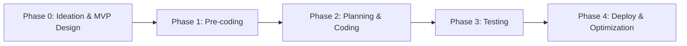
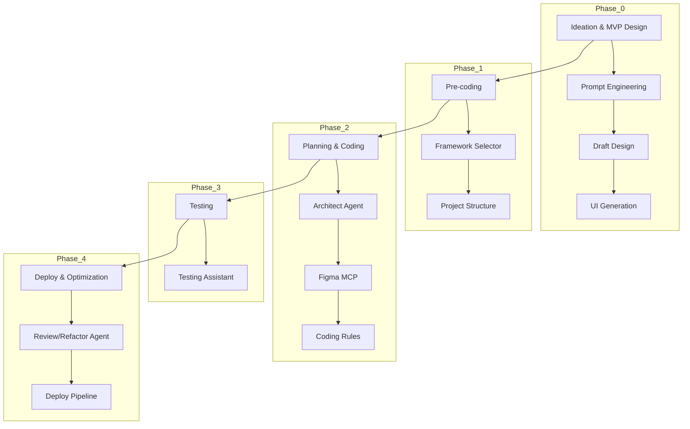
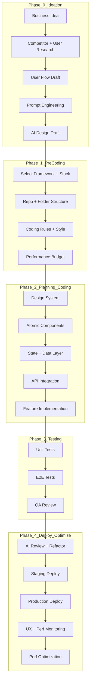

# AI-Integrated Frontend Product

Frontend product workflow with AI-assisted planning, implementation, testing, and optimization.

## Level High

```mermaid
graph LR
    P0["Phase 0: Ideation & MVP Design"] --> P1["Phase 1: Pre-coding"]
    P1 --> P2["Phase 2: Planning & Coding"] --> P3["Phase 3: Testing"]
    P3 --> P4["Phase 4: Deploy & Optimization"]
```

---

## Level Mid

```mermaid
graph TB
    subgraph Phase_0
        P0["Ideation & MVP Design"]
        Prompt["Prompt Engineering"]
        Draft["Draft Design"]
        UIGen["UI Generation"]
        P0 --> Prompt --> Draft --> UIGen
    end

    subgraph Phase_1
        P1["Pre-coding"]
        Framework["Framework Selector"]
        Structure["Project Structure"]
        P1 --> Framework --> Structure
    end

    subgraph Phase_2
        P2["Planning & Coding"]
        Architect["Architect Agent"]
        Figma["Figma MCP"]
        Rules["Coding Rules"]
        P2 --> Architect --> Figma --> Rules
    end

    subgraph Phase_3
        P3["Testing"]
        TestingAI["Testing Assistant"]
        P3 --> TestingAI
    end

    subgraph Phase_4
        P4["Deploy & Optimization"]
        ReviewAI["Review/Refactor Agent"]
        Deploy["Deploy Pipeline"]
        P4 --> ReviewAI --> Deploy
    end

    P0 --> P1 --> P2 --> P3 --> P4
```

---

## Level Low

```mermaid
graph TB
    subgraph Phase_0_Ideation
        Idea["Business Idea"]
        Research["Competitor + User Research"]
        Flows["User Flow Draft"]
        Prompt["Prompt Engineering"]
        Draft["AI Design Draft"]
        Idea --> Research --> Flows --> Prompt --> Draft
    end

    subgraph Phase_1_PreCoding
        Stack["Select Framework + Stack"]
        Structure["Repo + Folder Structure"]
        Rules["Coding Rules + Style"]
        PerfBudget["Performance Budget"]
        Stack --> Structure --> Rules --> PerfBudget
    end

    subgraph Phase_2_Planning_Coding
        System["Design System"]
        Components["Atomic Components"]
        State["State + Data Layer"]
        API["API Integration"]
        Build["Feature Implementation"]
        System --> Components --> State --> API --> Build
    end

    subgraph Phase_3_Testing
        Unit["Unit Tests"]
        E2E["E2E Tests"]
        QA["QA Review"]
        Unit --> E2E --> QA
    end

    subgraph Phase_4_Deploy_Optimize
        Review["AI Review + Refactor"]
        Staging["Staging Deploy"]
        Prod["Production Deploy"]
        Monitor["UX + Perf Monitoring"]
        Optimize["Perf Optimization"]
        Review --> Staging --> Prod --> Monitor --> Optimize
    end

    Draft --> Stack
    PerfBudget --> System
    Build --> Unit
    QA --> Review
```
