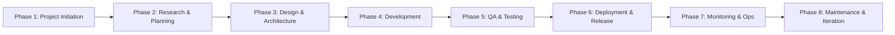
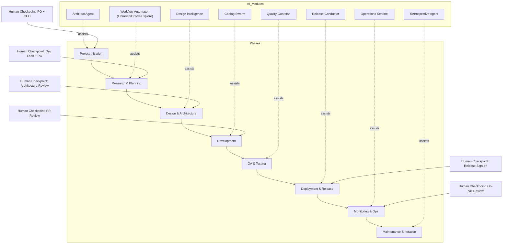
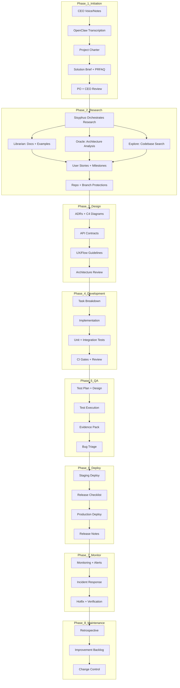

# AI-Integrated SDLC SOP

Eight-phase software development SOP with AI-assisted automation and human checkpoints.

## Level High

```mermaid
graph LR
    P1["Phase 1: Project Initiation"] --> P2["Phase 2: Research & Planning"] --> P3["Phase 3: Design & Architecture"]
    P3 --> P4["Phase 4: Development"] --> P5["Phase 5: QA & Testing"]
    P5 --> P6["Phase 6: Deployment & Release"] --> P7["Phase 7: Monitoring & Ops"]
    P7 --> P8["Phase 8: Maintenance & Iteration"]
```

---

## Level Mid

```mermaid
graph TB
    subgraph Phases
        P1["Project Initiation"]
        P2["Research & Planning"]
        P3["Design & Architecture"]
        P4["Development"]
        P5["QA & Testing"]
        P6["Deployment & Release"]
        P7["Monitoring & Ops"]
        P8["Maintenance & Iteration"]
    end

    subgraph AI_Modules
        A1["Architect Agent"]
        A2["Workflow Automator (Librarian/Oracle/Explore)"]
        A3["Design Intelligence"]
        A4["Coding Swarm"]
        A5["Quality Guardian"]
        A6["Release Conductor"]
        A7["Operations Sentinel"]
        A8["Retrospective Agent"]
    end

    H1["Human Checkpoint: PO + CEO"]
    H2["Human Checkpoint: Dev Lead + PO"]
    H3["Human Checkpoint: Architecture Review"]
    H4["Human Checkpoint: PR Review"]
    H5["Human Checkpoint: Release Sign-off"]
    H6["Human Checkpoint: On-call Review"]

    P1 --> P2 --> P3 --> P4 --> P5 --> P6 --> P7 --> P8

    A1 -.assists.-> P1
    A2 -.assists.-> P2
    A3 -.assists.-> P3
    A4 -.assists.-> P4
    A5 -.assists.-> P5
    A6 -.assists.-> P6
    A7 -.assists.-> P7
    A8 -.assists.-> P8

    H1 --> P1
    H2 --> P2
    H3 --> P3
    H4 --> P4
    H5 --> P6
    H6 --> P7
```

---

## Level Low

```mermaid
graph TB
    subgraph Phase_1_Initiation
        CEO["CEO Voice/Notes"]
        Transcribe["OpenClaw Transcription"]
        Charter["Project Charter"]
        PRFAQ["Solution Brief + PRFAQ"]
        Review1["PO + CEO Review"]
        CEO --> Transcribe --> Charter --> PRFAQ --> Review1
    end

    subgraph Phase_2_Research
        Orchestrate["Sisyphus Orchestrates Research"]
        Lib["Librarian: Docs + Examples"]
        Ora["Oracle: Architecture Analysis"]
        Exp["Explore: Codebase Search"]
        Stories["User Stories + Milestones"]
        Repo["Repo + Branch Protections"]
        Orchestrate --> Lib
        Orchestrate --> Ora
        Orchestrate --> Exp
        Lib --> Stories
        Ora --> Stories
        Exp --> Stories
        Stories --> Repo
    end

    subgraph Phase_3_Design
        ADRs["ADRs + C4 Diagrams"]
        API["API Contracts"]
        UX["UX/Flow Guidelines"]
        Review2["Architecture Review"]
        ADRs --> API --> UX --> Review2
    end

    subgraph Phase_4_Development
        Tasks["Task Breakdown"]
        Implement["Implementation"]
        Tests["Unit + Integration Tests"]
        CI["CI Gates + Review"]
        Tasks --> Implement --> Tests --> CI
    end

    subgraph Phase_5_QA
        TestPlan["Test Plan + Design"]
        Exec["Test Execution"]
        Evidence["Evidence Pack"]
        Triage["Bug Triage"]
        TestPlan --> Exec --> Evidence --> Triage
    end

    subgraph Phase_6_Deploy
        Staging["Staging Deploy"]
        Checklist["Release Checklist"]
        Prod["Production Deploy"]
        Notes["Release Notes"]
        Staging --> Checklist --> Prod --> Notes
    end

    subgraph Phase_7_Monitor
        Alerts["Monitoring + Alerts"]
        Incidents["Incident Response"]
        Hotfix["Hotfix + Verification"]
        Alerts --> Incidents --> Hotfix
    end

    subgraph Phase_8_Maintenance
        Retro["Retrospective"]
        Backlog["Improvement Backlog"]
        Change["Change Control"]
        Retro --> Backlog --> Change
    end

    Review1 --> Orchestrate
    Repo --> ADRs
    Review2 --> Tasks
    CI --> TestPlan
    Triage --> Staging
    Notes --> Alerts
    Hotfix --> Retro
```
