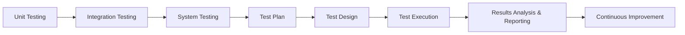
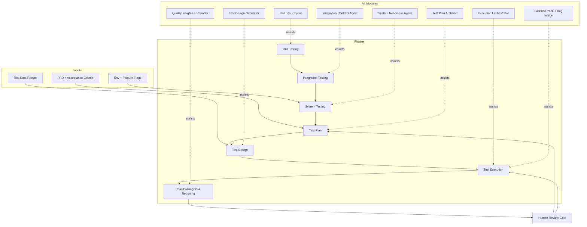
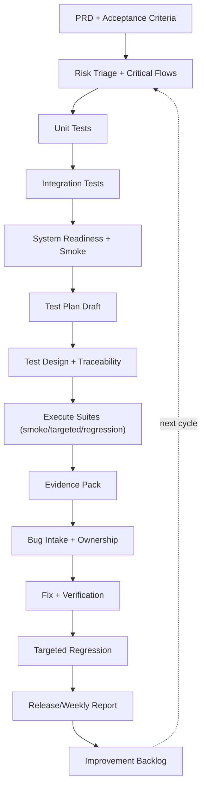

# AI Testing Lifecycle

Testing lifecycle from unit to reporting, with AI assistance and human review gates.

## Level High

```mermaid
graph LR
    Unit["Unit Testing"] --> Integration["Integration Testing"] --> System["System Testing"]
    System --> Plan["Test Plan"] --> Design["Test Design"] --> Execution["Test Execution"]
    Execution --> Reporting["Results Analysis & Reporting"] --> Improve["Continuous Improvement"]
```

---

## Level Mid

```mermaid
graph TB
    subgraph Inputs
        PRD["PRD + Acceptance Criteria"]
        Data["Test Data Recipe"]
        Env["Env + Feature Flags"]
    end

    subgraph Phases
        Unit["Unit Testing"]
        Integration["Integration Testing"]
        System["System Testing"]
        Plan["Test Plan"]
        Design["Test Design"]
        Execution["Test Execution"]
        Reporting["Results Analysis & Reporting"]
    end

    subgraph AI_Modules
        UnitAI["Unit Test Copilot"]
        IntegrationAI["Integration Contract Agent"]
        SystemAI["System Readiness Agent"]
        PlanAI["Test Plan Architect"]
        DesignAI["Test Design Generator"]
        ExecAI["Execution Orchestrator"]
        ReportAI["Quality Insights & Reporter"]
        EvidenceAI["Evidence Pack + Bug Intake"]
    end

    Human["Human Review Gate"]

    PRD --> Plan
    Data --> Design
    Env --> System

    Unit --> Integration --> System --> Plan --> Design --> Execution --> Reporting

    UnitAI -.assists.-> Unit
    IntegrationAI -.assists.-> Integration
    SystemAI -.assists.-> System
    PlanAI -.assists.-> Plan
    DesignAI -.assists.-> Design
    ExecAI -.assists.-> Execution
    ReportAI -.assists.-> Reporting
    EvidenceAI -.assists.-> Execution

    Human --> Plan
    Human --> Execution
    Reporting --> Human
```

---

## Level Low

```mermaid
graph TB
    PRD["PRD + Acceptance Criteria"] --> Risk["Risk Triage + Critical Flows"]
    Risk --> Unit["Unit Tests"]
    Unit --> Integration["Integration Tests"]
    Integration --> System["System Readiness + Smoke"]
    System --> Plan["Test Plan Draft"]
    Plan --> Design["Test Design + Traceability"]
    Design --> Execution["Execute Suites (smoke/targeted/regression)"]
    Execution --> Evidence["Evidence Pack"]
    Evidence --> Bug["Bug Intake + Ownership"]
    Bug --> Fix["Fix + Verification"]
    Fix --> Regression["Targeted Regression"]
    Regression --> Reporting["Release/Weekly Report"]
    Reporting --> Improve["Improvement Backlog"]
    Improve -.next cycle.-> Risk
```
