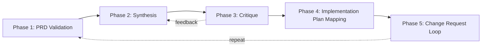
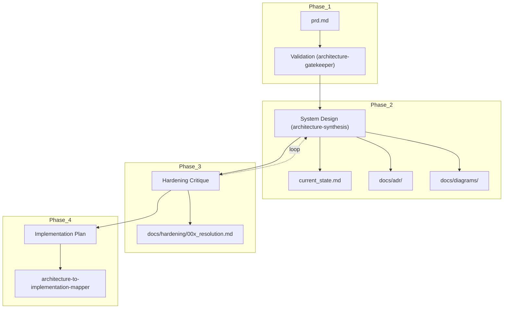
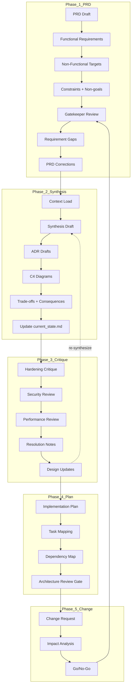

# Vibe System Designing

Architecture design workflow for the Vibe system, including validation, synthesis, critique, and implementation planning.

## Level High

---

## Level Mid

---

## Level Low

