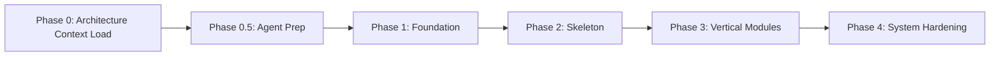
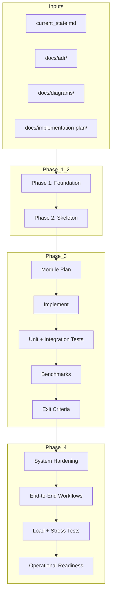
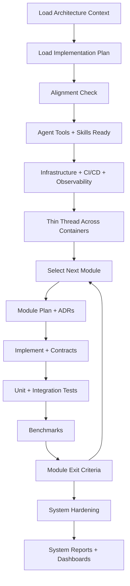

# Vibe System Implementation

Implementation workflow driven by architecture artifacts, phase gates, and module-level verification.

## Level High

```mermaid
graph LR
    P0["Phase 0: Architecture Context Load"] --> P05["Phase 0.5: Agent Prep"]
    P05 --> P1["Phase 1: Foundation"] --> P2["Phase 2: Skeleton"]
    P2 --> P3["Phase 3: Vertical Modules"] --> P4["Phase 4: System Hardening"]
```

---

## Level Mid

```mermaid
graph TB
    subgraph Inputs
        State["current_state.md"]
        ADRs["docs/adr/"]
        Diagrams["docs/diagrams/"]
        Plan["docs/implementation-plan/"]
    end

    subgraph Phase_1_2
        Foundation["Phase 1: Foundation"]
        Skeleton["Phase 2: Skeleton"]
    end

    subgraph Phase_3
        ModulePlan["Module Plan"]
        Implement["Implement"]
        Tests["Unit + Integration Tests"]
        Bench["Benchmarks"]
        Verify["Exit Criteria"]
        ModulePlan --> Implement --> Tests --> Bench --> Verify
    end

    subgraph Phase_4
        Hardening["System Hardening"]
        E2E["End-to-End Workflows"]
        Load["Load + Stress Tests"]
        Ops["Operational Readiness"]
        Hardening --> E2E --> Load --> Ops
    end

    Inputs --> Foundation --> Skeleton --> ModulePlan
    Verify --> Hardening
```

---

## Level Low

```mermaid
graph TB
    LoadCtx["Load Architecture Context"] --> LoadPlan["Load Implementation Plan"]
    LoadPlan --> Align["Alignment Check"]
    Align --> Prep["Agent Tools + Skills Ready"]
    Prep --> Foundation["Infrastructure + CI/CD + Observability"]
    Foundation --> Skeleton["Thin Thread Across Containers"]
    Skeleton --> ModulePick["Select Next Module"]
    ModulePick --> ModulePlan["Module Plan + ADRs"]
    ModulePlan --> Build["Implement + Contracts"]
    Build --> Tests["Unit + Integration Tests"]
    Tests --> Bench["Benchmarks"]
    Bench --> ModuleDone["Module Exit Criteria"]
    ModuleDone --> ModulePick
    ModuleDone --> Hardening["System Hardening"]
    Hardening --> Evidence["System Reports + Dashboards"]
```
