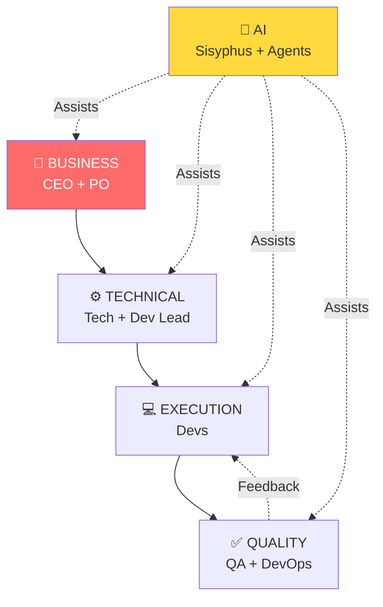
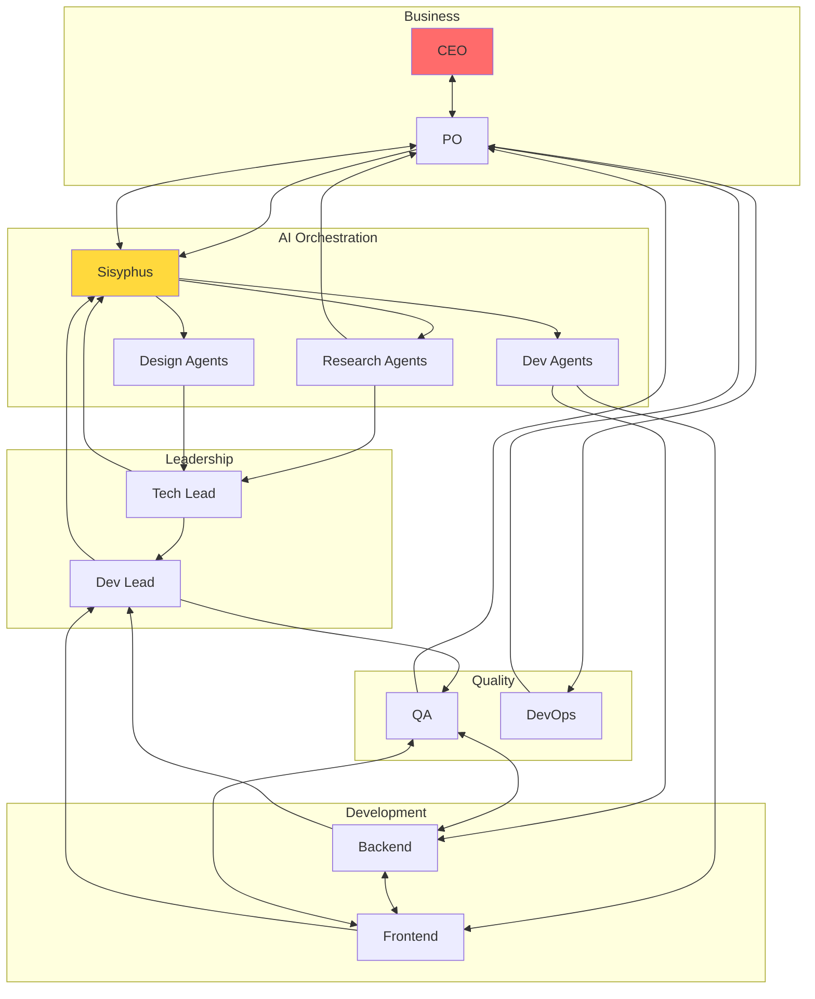

# PERSPECTIVE 2: PEOPLE & AI

Who collaborates, how humans and AI agents interact, and where the handoffs occur.

## 🔭 LEVEL HIGH (6 components)

---

## 🔬 LEVEL MID (20 components)

---

## 🔍 LEVEL LOW (45+ components)

```mermaid
graph TB
    subgraph HUMAN["━━━━━━━━━━━━━━ HUMAN TEAM ━━━━━━━━━━━━━━"]
        direction TB
        
        subgraph H_Business["Business Leadership"]
            CEO[CEO<br/>Vision + Budget]
            Client[Client<br/>Requirements]
            PO[Product Owner<br/>Scope + Priorities]
        end
        
        subgraph H_Technical["Technical Leadership"]
            TL[Tech Lead<br/>Architecture Authority]
            DL[Dev Lead<br/>Code Quality Gate]
            AR[Architecture Reviewer<br/>Senior Devs]
        end
        
        subgraph H_Development["Development Team"]
            BE1[Backend Dev 1<br/>API + DB]
            BE2[Backend Dev 2<br/>Services]
            FE1[Frontend Dev 1<br/>UI Components]
            FE2[Frontend Dev 2<br/>Integration]
        end
        
        subgraph H_Quality["Quality & Operations"]
            QA[QA Engineer<br/>Manual + Auto Testing]
            Sec[Security Reviewer<br/>Audits]
            Ops[DevOps Engineer<br/>Deploy + Infrastructure]
        end
    end
    
    subgraph AI["━━━━━━━━━━━━━━ AI AGENT LAYER ━━━━━━━━━━━━━━"]
        direction TB
        
        subgraph AI_Master["Master Orchestration"]
            Sis[🤖 SISYPHUS<br/>Master Orchestrator<br/>Claude Opus 4.5]
        end
        
        subgraph AI_P2["Phase 2: Research Agents"]
            Lib[Librarian<br/>Doc Search<br/>Sonnet 4.5]
            Ora[Oracle<br/>Analysis<br/>GPT-5.2]
            Exp[Explore<br/>Codebase<br/>Grok]
        end
        
        subgraph AI_P3["Phase 3: Design Agents"]
            GK[Gatekeeper<br/>Validate PRD]
            Syn[Synthesis<br/>Generate Design<br/>Ultrabrain]
            Hard[Hardening<br/>9 Stress Tests]
            Map[Mapper<br/>Create Tasks]
        end
        
        subgraph AI_P4["Phase 4: Development Agents"]
            Imp[Implementer<br/>Code Gen<br/>Oracle/Ultrabrain]
            Tst[Test Engineer<br/>Test Gen]
            Int[Integrator<br/>E2E Wiring]
            Adv[Adversarial<br/>Security Review]
            FEA[Frontend Engineer<br/>UI Gen<br/>Gemini 3 Pro]
        end
        
        subgraph AI_P5["Phase 5: Quality Agents"]
            TD[Test Design<br/>Generator]
            Bug[Bug Intake<br/>Evidence Packs]
            Tri[CI Triage<br/>Failure Routing]
        end
        
        subgraph AI_P7["Phase 7: Operations Agents"]
            Inc[Incident Sentinel<br/>Alert Routing]
        end
        
        subgraph AI_P8["Phase 8: Learning Agents"]
            Ret[Retrospective<br/>Agent<br/>Feedback Synthesis]
        end
    end
    
    %% Phase 1: Initiation
    Client -.Submit Requirements.-> CEO
    CEO -->|Project Request| PO
    PO -->|Draft Charter| CEO
    CEO -->|Review & Approve| PO
    
    %% Phase 2: Research
    PO -->|Research Request| Sis
    Sis -->|Delegate Workload| Lib
    Sis -->|Delegate Workload| Ora
    Sis -->|Delegate Workload| Exp
    Lib -->|Research Findings| Sis
    Ora -->|Analysis Report| Sis
    Exp -->|Codebase Context| Sis
    Sis -->|Synthesized Report| PO
    Sis -->|Tech Analysis| TL
    PO <-->|Scope Discussion| TL
    
    %% Phase 3: Architecture
    TL -->|Design Request| Sis
    Sis -->|PRD Validation| GK
    GK -->|Validated PRD| Syn
    Syn -->|Draft Design| Hard
    Hard -->|Critique Feedback| Syn
    Syn -->|Final ADRs + C4| Map
    Map -->|Implementation Plan| TL
    TL -->|Submit for Review| AR
    AR -->|Architecture Feedback| TL
    TL -->|Approved Design| DL
    
    %% Phase 4: Implementation - Setup
    DL -->|Task Assignment| Sis
    Sis <-->|Clarify Requirements| PO
    
    %% Phase 4: Contract Signing
    Sis -->|Draft Interface Contract| Imp
    Sis -->|Draft Interface Contract| Tst
    Imp <-->|Sign scratchpad.md| Tst
    
    %% Phase 4: Code Generation
    Sis -->|Backend Tasks| Imp
    Imp -->|Generated Code| BE1
    Imp -->|Generated Code| BE2
    
    Sis -->|Frontend Tasks| FEA
    FEA -->|Generated Components| FE1
    FEA -->|Generated Components| FE2
    
    %% Phase 4: Test Generation
    Sis -->|Test Tasks| Tst
    Tst -->|Unit Tests| BE1
    Tst -->|Unit Tests| BE2
    Tst -->|UI Tests| FE1
    Tst -->|UI Tests| FE2
    
    %% Phase 4: Developer Collaboration
    BE1 <-->|API Contracts| FE1
    BE2 <-->|API Contracts| FE2
    
    %% Phase 4: Code Review
    BE1 -->|Pull Request| DL
    BE2 -->|Pull Request| DL
    FE1 -->|Pull Request| DL
    FE2 -->|Pull Request| DL
    
    %% Phase 4: Security Review
    Sis -->|Security Check Request| Adv
    Adv -->|Security Audit| Sec
    Sec -->|Security Findings| DL
    
    %% Phase 4: Integration
    Sis -->|E2E Integration| Int
    Int -->|Integration Results| DL
    
    %% Phase 5: QA
    DL -->|Ready for QA| QA
    QA -->|Request Test Cases| TD
    TD -->|Generated Test Cases| QA
    
    QA <-->|Test Execution| BE1
    QA <-->|Test Execution| BE2
    QA <-->|Test Execution| FE1
    QA <-->|Test Execution| FE2
    
    QA -->|CI Test Failures| Tri
    Tri -->|Routed Bugs| Bug
    Bug -->|Bug Evidence Packs| BE1
    Bug -->|Bug Evidence Packs| BE2
    Bug -->|Bug Evidence Packs| FE1
    
    QA -->|Test Report + Signoff| PO
    
    %% Phase 6: Deployment
    PO -->|Go Decision| Ops
    Ops <-->|Deployment Issues| BE1
    Ops <-->|Deployment Issues| FE1
    Ops -->|Deploy Status| PO
    
    %% Phase 7: Monitoring
    Ops -->|Production Active| Inc
    Inc -->|Critical Alerts| Ops
    Ops -->|Hotfix Request| BE1
    Ops -->|Metrics Dashboard| PO
    Ops -->|Incident Reports| DL
    
    %% Phase 8: Retrospective
    PO -->|Retro Request| Ret
    Ret -->|Gather Feedback| BE1
    Ret -->|Gather Feedback| BE2
    Ret -->|Gather Feedback| FE1
    Ret -->|Gather Feedback| FE2
    Ret -->|Gather Feedback| QA
    Ret -->|Gather Feedback| Ops
    Ret -->|Lessons Report| PO
    PO -->|Process Updates| TL
    TL -->|Archive Skills| Sis
    
    %% Daily Coordination
    TL <-.Architecture Sync.-> DL
    DL <-.Daily Standup.-> BE1
    DL <-.Daily Standup.-> BE2
    DL <-.Daily Standup.-> FE1
    DL <-.Daily Standup.-> FE2
    
    %% Styling
    style HUMAN fill:#F5F5F5,stroke:#333333,stroke-width:4px
    style AI fill:#FFFACD,stroke:#FFD700,stroke-width:4px
    
    style H_Business fill:#FFE6E6,stroke:#CC0000,stroke-width:2px
    style H_Technical fill:#E6FFE6,stroke:#00AA00,stroke-width:2px
    style H_Development fill:#E6F3FF,stroke:#0066CC,stroke-width:2px
    style H_Quality fill:#FFE6F9,stroke:#CC00CC,stroke-width:2px
    
    style AI_Master fill:#FFD93D,stroke:#F4A261,stroke-width:3px
    style AI_P2 fill:#E6F3FF,stroke:#0066CC,stroke-width:2px
    style AI_P3 fill:#E6FFE6,stroke:#00AA00,stroke-width:2px
    style AI_P4 fill:#FFF4E6,stroke:#FF9900,stroke-width:2px
    style AI_P5 fill:#FFE6F9,stroke:#CC00CC,stroke-width:2px
    style AI_P7 fill:#E6FFFF,stroke:#00CCCC,stroke-width:2px
    style AI_P8 fill:#FFFACD,stroke:#FFD700,stroke-width:2px
    
    style CEO fill:#FF6B6B,color:#FFF
    style PO fill:#4ECDC4
    style TL fill:#95E1D3
    style Sis fill:#FFD93D,stroke:#F4A261,stroke-width:3px
    style BE1 fill:#F38181
    style FE1 fill:#AA96DA
    style QA fill:#FCBAD3
    style Ops fill:#C5A3FF
```

