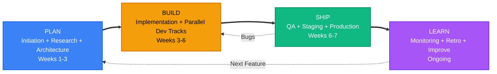
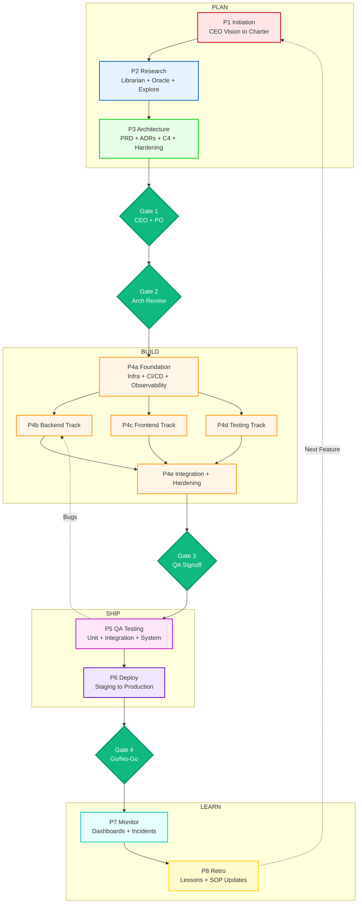

# PERSPECTIVE 1: WORK FLOW

What work happens, when it happens, and where parallelism exists.

This version merges the prior narrative structure (HIGH / MID / LOW zoom, PLAN -> BUILD -> SHIP -> LEARN) with the latest Mermaid flow definitions from `files/`.

## LEVEL HIGH

---

## LEVEL MID

---

## LEVEL LOW

```mermaid
graph TB
    classDef p1 fill:#FFE6E6,stroke:#CC0000,stroke-width:2px,color:#000
    classDef p2 fill:#E6F3FF,stroke:#0066CC,stroke-width:2px,color:#000
    classDef p3 fill:#E6FFE6,stroke:#00CC00,stroke-width:2px,color:#000
    classDef p4 fill:#FFF4E6,stroke:#FF9900,stroke-width:2px,color:#000
    classDef p5 fill:#FFE6F9,stroke:#CC00CC,stroke-width:2px,color:#000
    classDef p6 fill:#F0E6FF,stroke:#6600CC,stroke-width:2px,color:#000
    classDef p7 fill:#E6FFFF,stroke:#00CCCC,stroke-width:2px,color:#000
    classDef p8 fill:#FFFACD,stroke:#FFD700,stroke-width:2px,color:#000
    classDef gate fill:#10B981,color:#fff,stroke:#059669,stroke-width:3px
    classDef ai fill:#FFD93D,color:#000,stroke:#F4A261,stroke-width:2px

    subgraph PH1["PHASE 1 - INITIATION"]
        I1["CEO Voice Memo via Telegram"]:::p1
        I2["OpenClaw Transcription"]:::p1
        I3["Opus 4.5 Analysis"]:::ai
        I4["Project Charter Draft"]:::p1
        I5["Solution Brief + PRFAQ"]:::p1
        I1 --> I2 --> I3 --> I4
        I3 --> I5
    end

    subgraph PH2["PHASE 2 - RESEARCH"]
        R0["Sisyphus Orchestrates"]:::ai
        R1["Librarian - Doc Search"]:::ai
        R2["Oracle - Architecture"]:::ai
        R3["Explore - Codebase"]:::ai
        R4["Synthesize Findings"]:::p2
        R5["Generate User Stories"]:::p2
        R6["Create GitHub Repo + AGENTS.md"]:::p2
        R7["Create Lark Workspace"]:::p2
        R0 --> R1 & R2 & R3
        R1 & R2 & R3 --> R4 --> R5
        R5 --> R6 & R7
    end

    subgraph PH3["PHASE 3 - ARCHITECTURE"]
        A1["Gatekeeper validates PRD"]:::ai
        A2["Synthesis generates ADRs"]:::ai
        A3["C4 Context + Container + Component"]:::p3
        A4["Hardening 9 stress tests"]:::ai
        A5["Resolve critiques"]:::p3
        A6["Mapper creates Impl Plan"]:::ai
        A7["API contracts defined"]:::p3
        A1 --> A2 --> A3
        A2 --> A4 --> A5 --> A2
        A3 --> A6 --> A7
    end

    subgraph PH4["PHASE 4 - IMPLEMENTATION"]
        subgraph PH4F["Foundation"]
            F1["Infrastructure Provision"]:::p4
            F2["CI/CD Pipeline"]:::p4
            F3["Observability Setup"]:::p4
        end
        subgraph PH4BE["Backend Track"]
            BE1["Auth Module"]:::p4
            BE2["Core Business Logic"]:::p4
            BE3["Data Layer + APIs"]:::p4
        end
        subgraph PH4FE["Frontend Track"]
            FE1["Framework Setup"]:::p4
            FE2["Components"]:::p4
            FE3["Integration"]:::p4
        end
        subgraph PH4T["Testing Track"]
            T1["Unit Tests"]:::p4
            T2["Integration Tests"]:::p4
            T3["Contract Tests"]:::p4
        end
        subgraph PH4I["Integration"]
            INT1["Integrator Agent"]:::ai
            INT2["Load Testing"]:::p4
            INT3["Security Scan"]:::p4
        end
        F1 & F2 & F3 --> BE1 & FE1 & T1
        BE1 --> BE2 --> BE3
        FE1 --> FE2 --> FE3
        T1 --> T2 --> T3
        BE3 & FE3 & T3 --> INT1
        INT1 --> INT2 --> INT3
    end

    subgraph PH5["PHASE 5 - QA"]
        Q1["Test Design Generator"]:::ai
        Q2["Unit Test Execution"]:::p5
        Q3["Integration Test Execution"]:::p5
        Q4["System + E2E Tests"]:::p5
        Q5["Bug Intake Agent"]:::ai
        Q6["CI Triage Agent"]:::ai
        Q7["Evidence Pack Generation"]:::p5
        Q1 --> Q2 --> Q3 --> Q4
        Q4 --> Q7
        Q5 --> Q6
    end

    subgraph PH6["PHASE 6 - DEPLOYMENT"]
        D1["Staging Deploy"]:::p6
        D2["Health Checks"]:::p6
        D3["Rollback Plan Ready"]:::p6
        D4["Production Deploy"]:::p6
        D5["Release Notes Auto-Gen"]:::ai
        D1 --> D2 --> D3 --> D4
        D4 --> D5
    end

    subgraph PH7["PHASE 7 - MONITORING"]
        M1["Error Tracking via Sentry"]:::p7
        M2["AI Severity Classification"]:::ai
        M3["Auto Bug Tickets"]:::ai
        M4["Performance Dashboards"]:::p7
        M5["Heartbeat Checks 15min"]:::p7
        M6["Incident Response"]:::p7
        M1 --> M2 --> M3
        M4 --> M5
        M5 --> M6
    end

    subgraph PH8["PHASE 8 - RETROSPECTIVE"]
        RT1["Collect Feedback"]:::p8
        RT2["Retrospective Agent"]:::ai
        RT3["Update SOPs"]:::p8
        RT4["Archive Skills Learned"]:::p8
        RT5["Roadmap Draft"]:::ai
        RT1 --> RT2 --> RT3 --> RT4
        RT2 --> RT5
    end

    G1{"Gate 1 - CEO + PO Approve"}:::gate
    G2{"Gate 2 - Architecture Review"}:::gate
    G3{"Gate 3 - QA Signoff"}:::gate
    G4{"Gate 4 - Go/No-Go"}:::gate

    I5 --> G1 --> R0
    R7 --> G2 --> A1
    A7 --> F1
    INT3 --> G3 --> Q1
    Q7 --> D1
    D4 --> G4 --> M1
    RT5 -.->|"Next Feature"| I1
    Q5 -.->|"Fix Bugs"| BE2
    M3 -.->|"Hotfix"| BE2
```

