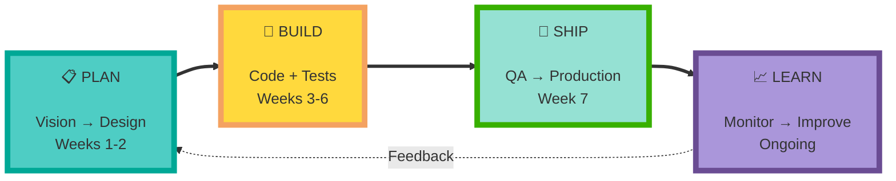
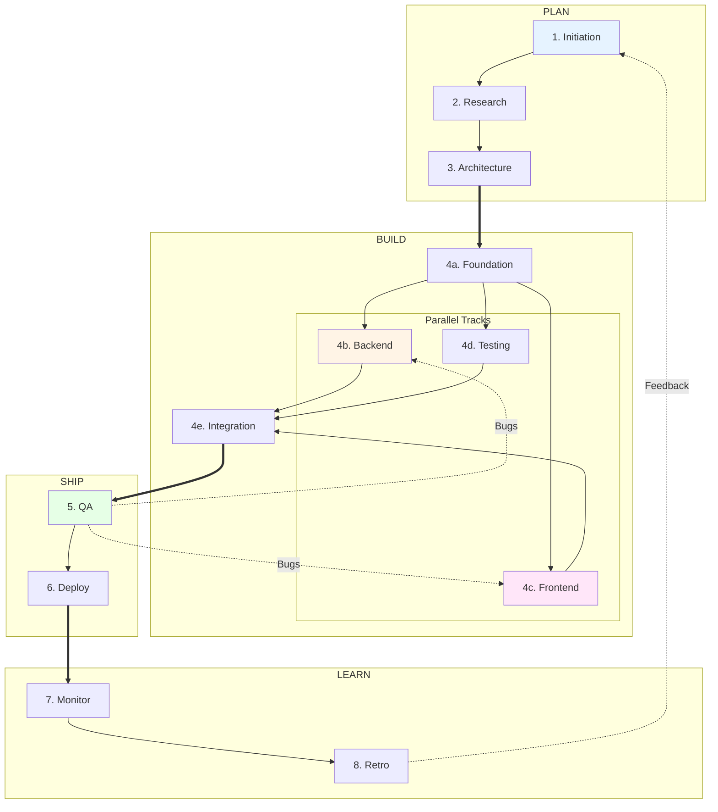

# PERSPECTIVE 1: WORK FLOW

What work happens, when it happens, and where parallelism exists.

## 🔭 LEVEL HIGH (4 components)

---

## 🔬 LEVEL MID (16 components)

---

## 🔍 LEVEL LOW (50+ components)

```mermaid
graph TB
    Start([🎬 Project Kickoff])
    
    subgraph P1["━━━ PHASE 1: INITIATION ━━━"]
        direction TB
        I1[CEO Vision Input<br/>Voice Memo/Telegram]
        I2[OpenClaw<br/>Transcription]
        I3[Opus 4.5<br/>Analysis]
        I4[Generate<br/>Project Charter]
        I5{CEO + PO<br/>Approve?}
        
        I1 --> I2 --> I3 --> I4 --> I5
        I5 -->|No - Revise| I4
    end
    
    subgraph P2["━━━ PHASE 2: RESEARCH & PLANNING ━━━"]
        direction TB
        R1[Sisyphus<br/>Orchestrates]
        
        subgraph R_Agents["AI Research Agents"]
            R2[Librarian<br/>Doc Search]
            R3[Oracle<br/>Analysis]
            R4[Explore<br/>Codebase]
        end
        
        R5[Synthesize<br/>Findings]
        R6[Generate<br/>User Stories]
        R7[Create Artifacts:<br/>GitHub + Lark]
        R8{Dev Lead + PO<br/>Approve?}
        
        R1 --> R2
        R1 --> R3
        R1 --> R4
        R2 --> R5
        R3 --> R5
        R4 --> R5
        R5 --> R6
        R6 --> R7
        R7 --> R8
        R8 -->|No - Refine| R5
    end
    
    subgraph P3["━━━ PHASE 3: ARCHITECTURE ━━━"]
        direction TB
        A1[Gatekeeper<br/>Validate PRD]
        A2[Synthesis<br/>Generate ADRs + C4]
        A3[Hardening<br/>9 Stress Tests]
        A4{Critical<br/>Issues?}
        A5[Mapper<br/>Create Impl Plan]
        A6{Architecture<br/>Review Approve?}
        
        A1 --> A2 --> A3 --> A4
        A4 -->|Yes - Fix| A2
        A4 -->|No| A5 --> A6
        A6 -->|No - Redesign| A2
    end
    
    subgraph P4["━━━ PHASE 4: IMPLEMENTATION ━━━"]
        direction TB
        
        subgraph P4_Foundation["4a. Foundation Layer"]
            F1[Infrastructure<br/>Provision]
            F2[CI/CD<br/>Setup]
            F3[Observability<br/>Configure]
            F1 --- F2 --- F3
        end
        
        subgraph P4_Parallel["4b. Parallel Development Tracks"]
            direction LR
            
            subgraph P4_Backend["Backend Track"]
                BE1[Module 1:<br/>Auth]
                BE2[Module 2:<br/>Core Logic]
                BE3[Module 3:<br/>Data Layer]
                BE1 --> BE2 --> BE3
            end
            
            subgraph P4_Frontend["Frontend Track"]
                FE1[Framework<br/>Setup]
                FE2[Component<br/>Library]
                FE3[Page<br/>Integration]
                FE1 --> FE2 --> FE3
            end
            
            subgraph P4_Testing["Testing Track"]
                T1[Unit<br/>Tests]
                T2[Integration<br/>Tests]
                T3[Contract<br/>Tests]
                T1 --> T2 --> T3
            end
        end
        
        subgraph P4_Integration["4c. Integration & Hardening"]
            INT1[Integrator Agent<br/>E2E Wiring]
            INT2[Load Testing]
            INT3[Security Scan]
            INT1 --> INT2 --> INT3
        end
        
        F3 --> BE1
        F3 --> FE1
        F3 --> T1
        BE3 --> INT1
        FE3 --> INT1
        T3 --> INT1
    end
    
    subgraph P5["━━━ PHASE 5: QA TESTING ━━━"]
        direction TB
        
        subgraph P5_Generation["Test Generation"]
            Q1[Test Design Agent<br/>Generate Cases]
            Q2[Bug Intake Agent<br/>Evidence Packs]
        end
        
        subgraph P5_Execution["Test Execution"]
            Q3[Unit Test<br/>Execution]
            Q4[Integration Test<br/>Execution]
            Q5[System Test<br/>Execution]
            Q6[E2E Test<br/>Execution]
            Q3 --> Q4 --> Q5 --> Q6
        end
        
        subgraph P5_Validation["Validation"]
            Q7[CI Triage Agent<br/>Analyze Failures]
            Q8{Critical<br/>Bugs Found?}
            Q9{QA Engineer<br/>Sign Off?}
            Q7 --> Q8 --> Q9
        end
        
        Q1 --> Q3
        Q6 --> Q7
        Q8 -->|Yes - Create Evidence| Q2
        Q9 -->|No - Fix Required| Q2
    end
    
    subgraph P6["━━━ PHASE 6: DEPLOYMENT ━━━"]
        direction TB
        
        subgraph P6_Staging["Staging Environment"]
            D1[Build<br/>Staging]
            D2[Deploy<br/>Staging]
            D3[Validation<br/>Tests]
            D1 --> D2 --> D3
        end
        
        subgraph P6_Decision["Go/No-Go"]
            D4[Risk<br/>Assessment]
            D5{PO + DevOps<br/>Approve Deploy?}
            D4 --> D5
        end
        
        subgraph P6_Production["Production Environment"]
            D6[Deploy<br/>Production]
            D7[Health<br/>Checks]
            D8{All Systems<br/>Green?}
            D6 --> D7 --> D8
        end
        
        D3 --> D4
        D5 -->|Go| D6
        D5 -->|No-Go - Fix| Q1
        D8 -->|No - Rollback| D1
    end
    
    subgraph P7["━━━ PHASE 7: MONITORING ━━━"]
        direction TB
        
        subgraph P7_Observability["Observability Stack"]
            M1[Sentry<br/>Error Tracking]
            M2[Datadog<br/>Metrics]
            M3[ELK<br/>Log Aggregation]
        end
        
        subgraph P7_Response["Incident Response"]
            M4[Incident Sentinel<br/>Alert Routing]
            M5{Critical<br/>Incident?}
            M6[Auto-Alert<br/>On-Call]
            M7[Hotfix<br/>Workflow]
            M4 --> M5
            M5 -->|Yes| M6 --> M7
        end
        
        subgraph P7_Review["Weekly Review"]
            M8[SLA<br/>Tracking]
            M9{Performance<br/>Acceptable?}
            M8 --> M9
        end
        
        M1 --> M4
        M2 --> M4
        M3 --> M4
        M5 -->|No| M8
        M7 --> BE1
    end
    
    subgraph P8["━━━ PHASE 8: RETROSPECTIVE ━━━"]
        direction TB
        
        subgraph P8_Collection["Feedback Collection"]
            RT1[Retrospective Agent<br/>Gathers Input]
            RT2[Analyze<br/>What Worked]
            RT3[Analyze<br/>What Failed]
            RT1 --> RT2
            RT1 --> RT3
        end
        
        subgraph P8_Documentation["Documentation"]
            RT4[Lessons<br/>Learned Doc]
            RT5[Update<br/>SOPs]
            RT6[Archive<br/>Skills]
            RT2 --> RT4
            RT3 --> RT4
            RT4 --> RT5
            RT4 --> RT6
        end
        
        subgraph P8_Closure["Closure"]
            RT7{Cycle<br/>Complete?}
            RT7 -->|Yes - Next Feature| Start
        end
        
        RT6 --> RT7
    end
    
    %% Cross-phase flows
    Start --> I1
    I5 -->|Yes - Approved| R1
    R8 -->|Yes - Approved| A1
    A6 -->|Yes - Approved| F1
    INT3 --> Q1
    Q9 -->|Yes - Approved| D1
    D8 -->|Yes - Stable| M1
    M9 -->|Yes - Healthy| RT1
    
    %% Feedback loops
    Q2 -.Bug Fix.-> BE1
    Q2 -.Bug Fix.-> FE1
    
    %% Gate styling
    style I5 fill:#90EE90,stroke:#00AA00,stroke-width:3px
    style R8 fill:#90EE90,stroke:#00AA00,stroke-width:3px
    style A6 fill:#90EE90,stroke:#00AA00,stroke-width:3px
    style Q9 fill:#90EE90,stroke:#00AA00,stroke-width:3px
    style D5 fill:#90EE90,stroke:#00AA00,stroke-width:3px
    style D8 fill:#90EE90,stroke:#00AA00,stroke-width:3px
    style M9 fill:#90EE90,stroke:#00AA00,stroke-width:3px
    style RT7 fill:#90EE90,stroke:#00AA00,stroke-width:3px
    
    %% Phase styling
    style P1 fill:#FFE6E6,stroke:#CC0000,stroke-width:3px
    style P2 fill:#E6F3FF,stroke:#0066CC,stroke-width:3px
    style P3 fill:#E6FFE6,stroke:#00AA00,stroke-width:3px
    style P4 fill:#FFF4E6,stroke:#FF9900,stroke-width:3px
    style P5 fill:#FFE6F9,stroke:#CC00CC,stroke-width:3px
    style P6 fill:#F0E6FF,stroke:#6600CC,stroke-width:3px
    style P7 fill:#E6FFFF,stroke:#00CCCC,stroke-width:3px
    style P8 fill:#FFFACD,stroke:#FFD700,stroke-width:3px
```

