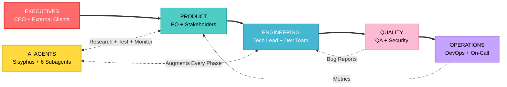
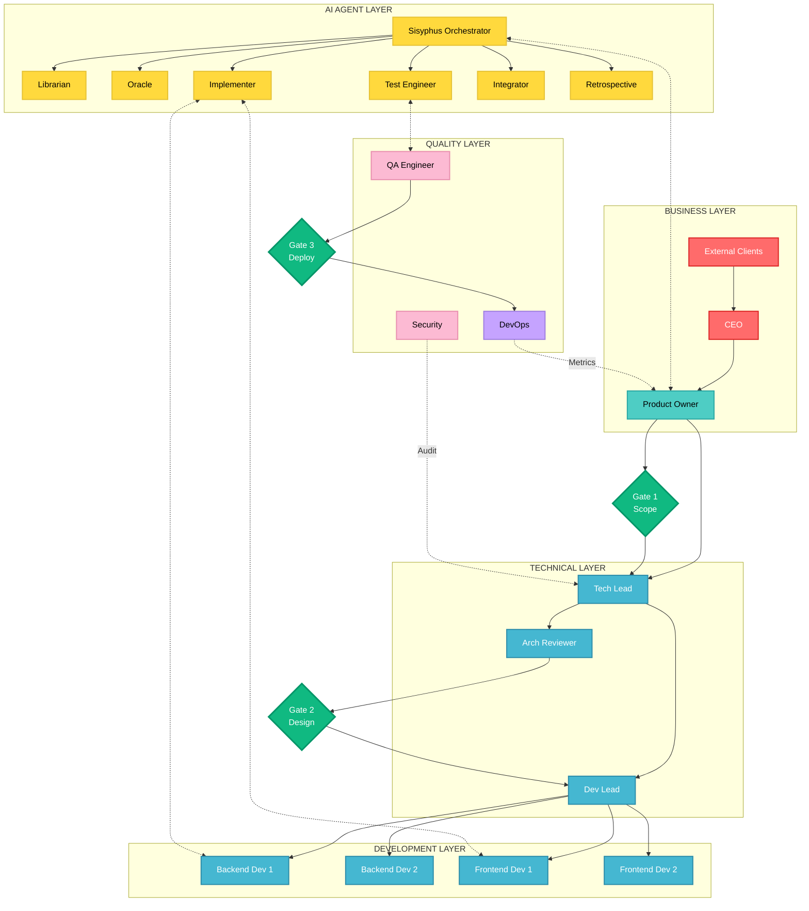
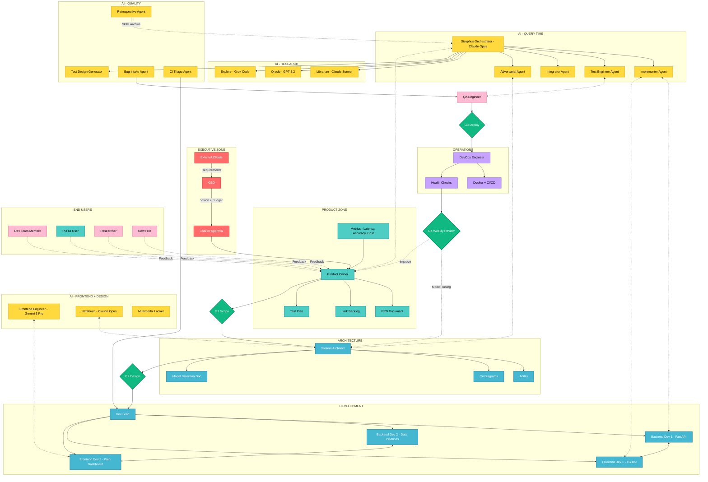

# PERSPECTIVE 2: PEOPLE AND AI

Who collaborates, how humans and AI agents interact, and where the handoffs occur.

This version merges the prior operating-model narrative with the latest role and agent definitions from `files/`.

## LEVEL HIGH

---

## LEVEL MID

---

## LEVEL LOW

