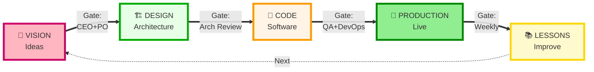
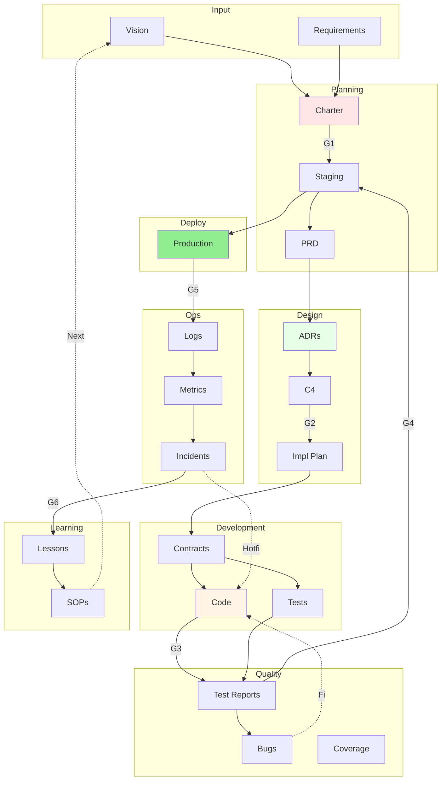
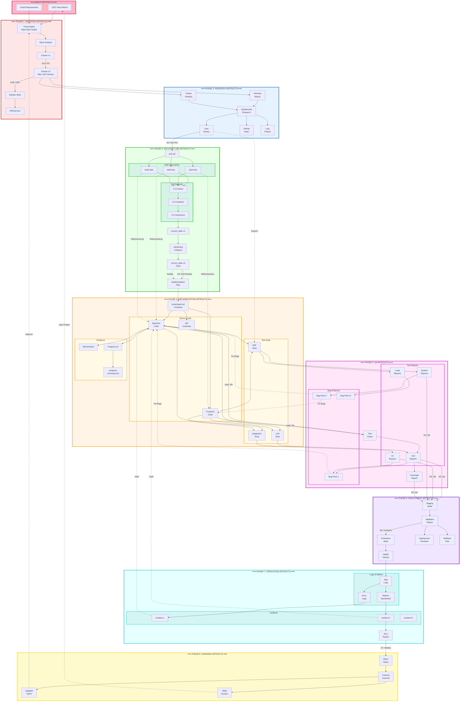

# PERSPECTIVE 3: GOVERNANCE

What moves through the system as artifacts, and who approves each gate.

## 🔭 LEVEL HIGH (6 components)

---

## 🔬 LEVEL MID (22 components)

---

## 🔍 LEVEL LOW (55+ components)

