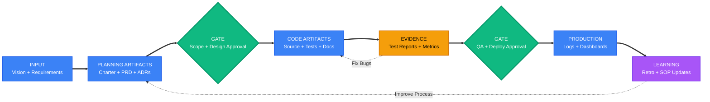
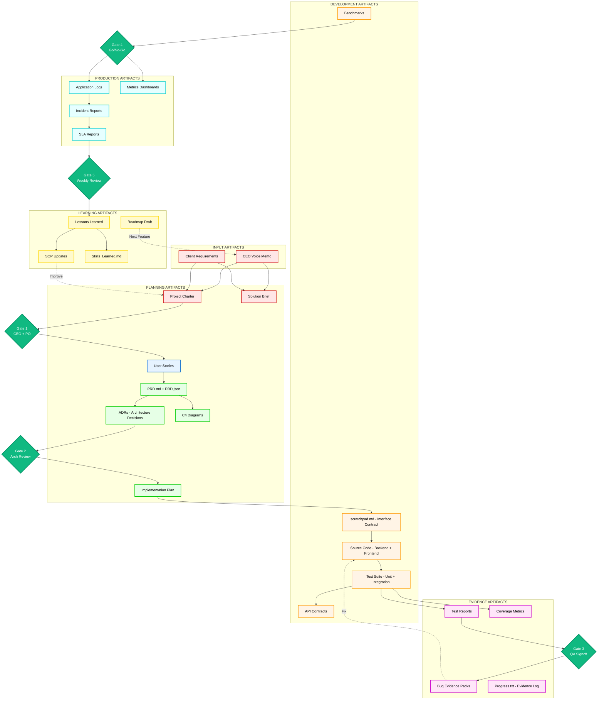
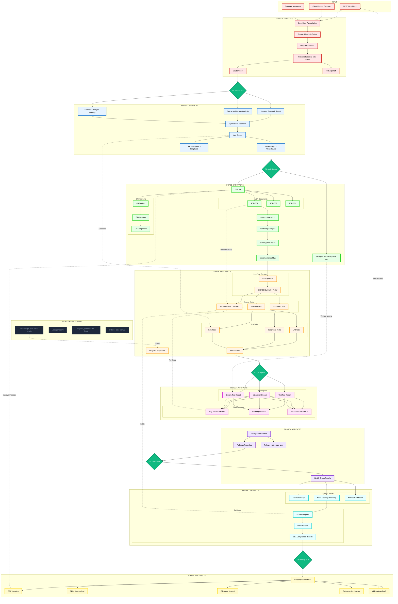

# PERSPECTIVE 3: GOVERNANCE

What moves through the system as artifacts, and who approves each gate.

This version preserves the prior governance perspective (artifact lineage and approvals) while upgrading content to the latest Mermaid definitions from `files/`.

## LEVEL HIGH

---

## LEVEL MID

---

## LEVEL LOW

